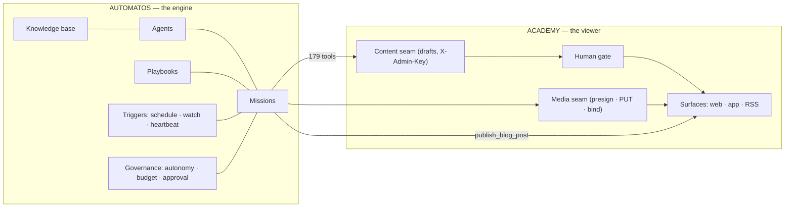

# The Academy Content Factory

> Automatos runs the factory. The Academy is a viewer that consumes what comes out of it.
> This is the engine's real capability surface, read from the platform, and the plan that
> follows from it. Grounded 2026-08-28 against both repos — every claim checked, not remembered.
>
> Web version: https://claude.ai/code/artifact/332c0b58-252a-49f8-9e0b-70b9e7157096
> This file is the uploadable twin (`platform_upload_document` takes markdown), so Auto
> can retrieve the plan it is part of.

## The framing correction this plan was rebuilt on

The first draft researched the Academy and treated Automatos as "some agents that call an
API." That was backwards. The orchestration primitives — mission planning, decomposition,
approval, replanning, scheduling, event triggers, budgets, autonomy — all live in the
engine already. The Academy contributes three seams and a review gate. Nothing more.

Consequence: **almost nothing needs building in either codebase.** The work is configuring
agents, writing playbooks, and deciding where the brakes go.

---

## 01 · What the engine actually is

Counted from the platform, not estimated: 109 tables, 103 API routers, **179 platform
tools in 37 families** an agent can call directly. Plan limits exist for customers; the
Academy workspace is ours and runs **uncapped** — which makes the budget dial matter more,
not less (see Decisions).

| Primitive | What it gives you | Tools |
|---|---|---|
| **Missions** | "The coordinator decomposes the goal into tasks, assigns agents, and orchestrates execution" — research and content creation are the documented use case | create · approve · reject · pause · resume · replan · update_plan |
| **Playbooks** | Reusable multi-step procedures, schedulable and executable | create · add_step · schedule · execute |
| **Skills** | Workspace-scoped capabilities incl. executable skill scripts | create_workspace_skill · load · run_skill_script |
| **Watches** | Event triggers — the factory becomes reactive, not scheduled | create_watch · list · cancel |
| **Heartbeats** | Per-agent periodic checks, active hours, proactive behaviour | configure_agent_heartbeat |
| **Knowledge** | Upload → chunk → embed → RAG; how an agent is trained on our material | upload_document · grep_documents · reprocess |
| **Blueprints** | Agent templates + validate_agent | create_blueprint · validate_agent |
| **Governance** | Autonomy dial, pre-call budget admission, approvals | get/set_autonomy_level · check_budget |

Also true and worth knowing: **agents can create agents** (`platform_create_agent`; the
agents table carries `cloned_from_id`, `install_count`, `is_featured` — a marketplace
shape), and **Composio is wired in** (apps/actions/connections cache) so third-party app
actions extend the same registry.

## 02 · Engine and viewer

The Academy has no scheduler, no retry logic, no planner and no agent registry — and must
never grow one. Recurring run → playbook schedule. Reactive run → watch. The viewer stays
a viewer.

## 03 · A mission, end to end

1. `create_mission` (goal) → coordinator decomposes into tasks, assigns agents
2. Plan comes back **for approval before spend** (approve / reject / replan)
3. Each task passes **budget admission before the call** (BudgetExceeded, not cost-logging after)
4. Output lands in the Academy as **DRAFT** — invisible to learners
5. Human approves → overrides cache refreshes → live on the next request

Two gates, not one: the mission gate asks "is this plan worth running?" before spend; the
Academy gate asks "is this output worth publishing?" after. They fail independently.

Four brakes, all real: mission approval · pre-call budget · draft approval ·
the autonomy dial (`standard` | `full`) whose `set` is **super-admin only** — an agent may
read its own dial, never turn it.

## 04 · The roster (five agents)

| Agent | Trigger | Does | Writes to |
|---|---|---|---|
| **News** | schedule, daily | researches + writes the day's briefing | publish_blog_post → The Wire |
| **Editor** | schedule, weekly | reads item-quality, rewrites questions the data says are broken | drafts |
| **Writer** | mission, on demand | lessons + knowledge checks for one domain | drafts (batch) |
| **Media** | **watch: domain approved** | Fish narration, then NotebookLM video | presign → bind |
| **Research** | mission, on demand | course proposals: blueprint, sources, honest case | deliverable (no write) |

The Media agent proves the point: triggered by a watch, not a schedule. Approve a domain →
event fires → narration exists. Nobody opens a terminal; no cron guesses.

The real constraint is not agent count (workspace is uncapped) — it is **how much output
you are willing to review**.

## 05 · The two lanes — and who authors what

The card contract's own words: *"Lane 1 = structured payload (agents write it, via
drafts). Lane 2 = rendered media in a media_bindings slot (CI renderers write it). Agents
have **no** media write path, by design."*

| Card type | Lane | Authored by | State |
|---|---|---|---|
| quiz | 1 | projected from existing questions — the only true "nobody" | ships now |
| flashcard | 1 | **agent**, as a draft | renderer built · LA-7 factory |
| explainback | 1 | **agent** — prompt + rubric | LA-10 |
| changelog | 1 | **agent** | LA-11 |
| infographic | 2 | agent drafts payload → **CI renders PNG** | LA-9 |
| minivideo | 2 | agent drafts payload → **CI renders MP4** | LA-14 |

Infographic and minivideo take the **same payload** — `{domainId, index, title, points[],
eyebrow?, source?}` — "the factory drafts one verified payload and both renderers film it."
Output is named for its slot, so `bulk-bind` publishes with no new vocabulary.

**Fish audio** is a plain REST call (`POST api.fish.audio/v1/tts`, Bearer `FISH_API_KEY`,
model s2.1-pro, voice locked to Laura) and is **deterministic from the lesson text** —
`buildSpoken(title, body)`, no prompt, no model choosing words. Content-addressed via
`audioHash`, so re-runs are free and real edits are unmissable. 429s are an operating
condition (concurrency tier scales with account spend); the lane backs off on Retry-After.

**NotebookLM generation is NOT built** — no API exists; generation is a human driving the
browser kit (`DUMPING AREA/ACADEMY/overview-kit/`). What is built is the publishing half
(`register-videos --publish` matches files on disk to slots). The 16 existing prompts are
paragraphs of editorial judgement — audience, cover-this-not-that, tone, length, closing
line — which makes prompt-writing a **Writer-agent task**. The planned lane: agent drafts
the prompt as a Lane-2 payload → human/kit drives the render → presign → bind. The
agents-have-no-media-write-path rule survives the new lane.

## 06 · How every content type gets uploaded

Three publishing planes. Drafts for anything that is JSON, bind for anything that is
bytes, the platform for news. Nothing else exists, and nothing else should.

| Content type | Created by | Uploads via | Plane | Live when |
|---|---|---|---|---|
| News | News agent | `platform_publish_blog_post` | 3 | ≤60s (cache TTL) |
| New course (manifest entry) | Research → Writer | draft, `scopeKind: manifest` | 1 | on approval |
| Curriculum (lessons) | Writer | draft, `scopeKind: domain` | 1 | on approval |
| Source library (resources) | Research | same domain draft — `resources[]` | 1 | on approval |
| Scenarios | Writer | same domain draft — `scenarios[]` | 1 | on approval |
| Mock-exam questions | Writer · Editor | same domain draft — `questions[]` | 1 | on approval |
| Readiness | **nobody** | computed from attempts × blueprint weights | — | always |
| Quiz cards | **nobody** | projected from `questions[]` | — | with their domain |
| Flash cards · facts | Writer | draft (LA-7, cite-or-die `chunkRef`) | 1 | on approval |
| Infographics | agent payload → CI PNG | render → bulk-bind (`ig-*.png`) | 1→2 | on bind |
| Mini-videos | agent payload → CI MP4 | render → bulk-bind (`mv-*.mp4`) | 1→2 | on bind |
| NotebookLM videos | agent prompt → kit render | presign → PUT → bind (`v-*.mp4`) | 1→2 | on bind |
| Lesson narration (Fish) | **nobody** — derived | Fish render → bind (`a-<lessonId>`) | 2 | on bind |
| Podcasts | NotebookLM audio today | S3 upload **+** draft, `scopeKind: podcasts` | 2+1 | on approval |

Key facts under that table:

- **New courses are picked up automatically — through the gate, zero deploys.** Courses
  are registered in `manifest.json`, not auto-discovered, and `manifest` is a legal draft
  scope. A new course = one manifest draft + one track draft + one domain draft per
  domain, approved as a batch. Every surface (web nav, mobile catalog, sitemap, hero
  counts, tutor corpus) reads the same catalog API — **the mobile app needs no release**.
- Curriculum, sources, scenarios and mock questions are **four arrays in one domain
  file**, not four upload paths.
- Podcasts are the one two-step publish: bytes to S3 (plane 2) + episode entry as a
  `podcasts`-scope draft (plane 1). The ✓ language already shares the raw episode id
  across web and app. Git's 100 MiB ceiling is irrelevant — bytes never touch git.
- Plane-1 overrides are **whole-document swaps** with byte-fidelity ("upload" never means
  "edit in place"), and plane 2 is closed to agents. There is no row on this table where
  agent output reaches a learner without an approval or a trusted-CI bind.
- Readiness and quiz cards upload **nothing, ever**. If either grows an upload path,
  something has gone wrong.

## 07 · The plan, in order

Each phase ends with something visible on the site.

- **0 · Credential and roster** — set `ACADEMY_ADMIN_KEY`; register it as a workspace
  connection; create the five agents from blueprints; upload the Academy's own docs
  (starting with this one) so agents retrieve house style rather than guess it.
  *Proof: an agent submits a throwaway draft and it is rejected.*
- **1 · News** — the daily briefing as a **scheduled playbook**. *Proof: nav entry, home
  teaser, RSS and byline all switch on within 60s of the first post.* Watch-out: the
  agent must live in workspace `894519f4-9fc3-40eb-bb9f-081e5b113a58` — publishing from
  the main workspace lands on automatos.app, silently.
- **2 · Editor before writer** — weekly playbook reading `/api/admin/content/item-quality`,
  proposing rewrites as drafts. An agent that can critique the corpus you know is one you
  can judge. *Proof: a question the stats say measures backwards comes back rewritten.*
- **3 · Writer** — one domain per mission; coordinator's plan reviewed before it runs;
  submitted as a batch. *Proof: a domain goes live from one approval, cards and scroller
  quizzes appearing automatically because they are derived.*
- **4 · Media on a watch** — Fish first (programmatic, content-addressed). NotebookLM
  second, honestly: no API, browser-driven, real failure modes (quota exhaustion, silent
  nulls, artifacts that vanish if deleted before a replacement exists). *Proof: a lesson
  approved in phase 3 has narration with nobody opening a terminal.*
- **5 · Research** — the only genuinely new lane: a mission producing a course proposal as
  a deliverable (exam/skill, blueprint, domain split, sources, the case against building).
  *Proof: a proposal you can decline without having paid for a writing run.*

## 08 · Decisions (open, Gerard's)

| Decision | The trade |
|---|---|
| Autonomy: standard or full? | `standard` asks before confirmation-gated actions. Start standard — the Academy draft gate is independent either way. |
| Budget, or uncapped? | Sharper here than for a customer: with no plan ceiling, `plan_limits.budget` (`max_cost_usd`, rolling window) is the **only** automatic spend brake. News + editor runs are predictable; a whole-track writer mission is the one that surprises. |
| Playbooks or missions for recurring work? | News and editing → playbooks. Writing and research → missions. |
| Does the editor ever bypass the gate? | Auto-approving "typo-only" fixes is exactly the exception that erodes a gate. Recommendation: no. |
| Blog widget auth | The Wire reads with a bare workspace UUID; chat uses a revocable, origin-locked `ak_pub_*` key that already carries `workspace_id` + `allowed_domains`. Platform fix: let blog endpoints accept `ak_pub_*` — one key, every widget. Close before an external customer embeds one. |

## 09 · New requirements on the Academy

The gap analysis, verified in the repo — not what the plan implies, but what the code
actually lacks. The headline is small: **phases 0–2 need configuration only.** The first
new Academy code is needed at phase 3, and there are exactly two hard gaps.

What already exists and needs nothing (checked, 2026-08-28):

- The machine principal (`X-Admin-Key`) gates drafts, batches, item-quality, media
  presign/bind — one env var to set, zero code.
- **Every render lane is already `workflow_dispatch`-able**: `deploy-media`,
  `render-infographic`, `render-minivideo`, `voice-catalog`, `voice-sample`,
  `content-publish`, `sync-tutor-corpus`. Machine-triggerable rendering exists; what is
  missing is only the *path* by which an agent fires a dispatch (R4).
- Batch approval is transactional (BEGIN … COMMIT, all-or-nothing) — the right bones for
  new-course batches. What it lacks is validation (R1/R2).
- `ACADEMY_WORKSPACE_ID` is live (checked: the Wire answers 200 post-#121).

### The requirements

| # | Requirement | Why (verified gap) | Blocks phase | Size |
|---|---|---|---|---|
| R1 | **Semantic validation on the draft plane** | Submission checks scope shape + JSON + size only; approval checks *nothing semantic* (`APPROVE_SQL` flips a status). The git lane runs `validate-content.mjs` (dead links, markdown leaks, card errors); drafts bypass all of it. An agent-written domain can go live with defects the git lane would have rejected. Run the same validators at submit (advisory) and approve (blocking). | 3 · Writer | the gap |
| R2 | **Tree-level integrity on batch approve** | R1's cross-document twin: a new-course batch (manifest + track + domains) must validate as a *resulting tree* — a manifest entry may never go live pointing at a track doc that isn't approved in the same batch. The transaction exists; the check doesn't. | 3 · Writer | with R1 |
| R3 | **Outbound approval events** | `onChange` only refreshes the overlay cache — nothing leaves the process. "Media on a watch" needs the Academy to emit a signed webhook on approve (scope, ids, batchId) that platform watches subscribe to. Extend the existing `notify()` seam. | 4 · Media | small |
| R4 | **Agent → CI dispatch path** | Workflows are dispatchable; the agent needs a way to fire one — either a GitHub token through Composio, or a thin Academy endpoint (behind the machine key) that proxies `workflow_dispatch`. Decision + small build. | 4 · Media | small |
| R5 | **Podcasts read-modify-write convention** | `podcasts` drafts are whole-document swaps: adding one episode means drafting the *entire* episode list, so concurrent drafts clobber. Document the convention (GET current → modify → draft); optionally add optimistic concurrency (draft carries the base hash, approve rejects if the base moved). | when podcasts automate | note / small |
| R6 | **A home for NotebookLM prompt payloads** | The Writer agent drafts video prompts (§5), but there is no payload type or storage for them yet — the 16 existing prompts live loose in the overview-kit. Smallest honest answer: a payload convention beside the infographic/minivideo ones, named for the slot it renders into. | 4–5 | small |
| R7 | **Review tooling at factory scale** | The admin console lists drafts; reviewing an agent-written *domain* (30+ questions, lessons, scenarios in one document) wants a diff against the live doc, not raw JSON. Quality-of-review, not correctness. | when volume bites | soft |
| R8 | **Config, day 0** | Set `ACADEMY_ADMIN_KEY` on Railway; register it as the workspace connection; `FISH_API_KEY` already lives in CI secrets. | 0 | env only |

### Build order

1. **R8** — day 0, no code.
2. **R1 + R2 together** — before the Writer runs. This is the only substantial Academy
   build in the whole plan, and it is mostly *reuse*: the validators exist in
   `validate-content.mjs`; the work is running them against a draft-overlaid tree at
   approve time instead of only against git.
3. **R3 + R4** — before the Media watch. Both small; R3 is the one with a design choice
   (event shape, signing, retry).
4. **R5–R7** — as each becomes load-bearing, not before.

One rule worth writing down now: **R1 failures must block approval, not publication.**
The moment a "publish anyway" override exists, the factory's quality floor is whatever a
tired reviewer clicks past. The git lane has no such override; the draft lane shouldn't
either.

---

*Provenance: tool registry counted from `orchestrator/modules/tools/discovery/actions_*.py`;
primitives from the missions/playbooks/skills/watches/documents/governance/autonomy
families; budget mechanism from `modules/policy/budget.py` (the Academy workspace itself
is uncapped); core abstractions from the platform's knowledge graph (27,676 nodes).
Academy lanes from its `npm test` chain, `server/content/validate.js` (`SCOPE_KINDS`),
`server/audio/fishLane.js`, `docs/CARD-CONTRACT.md`, and `scripts/publish-content.mjs`.*
