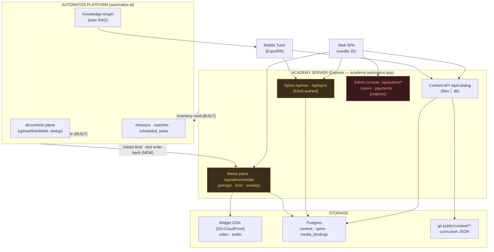
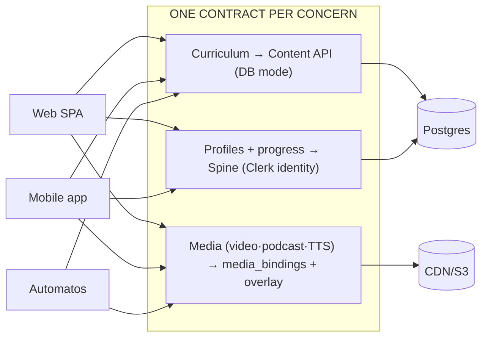
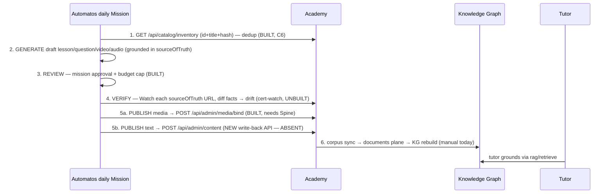
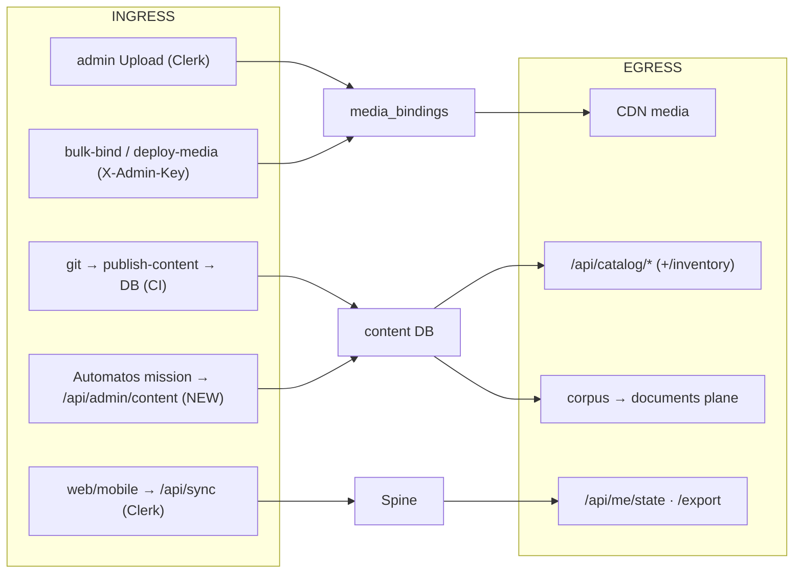
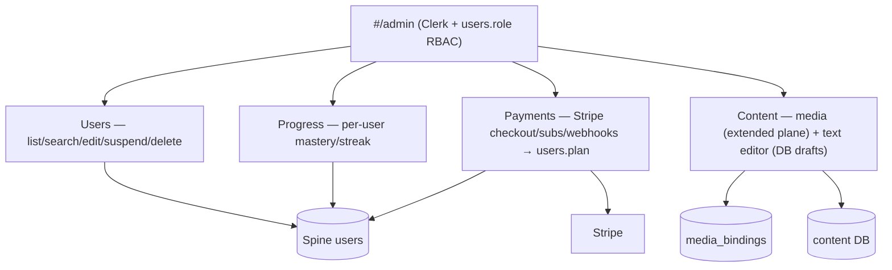
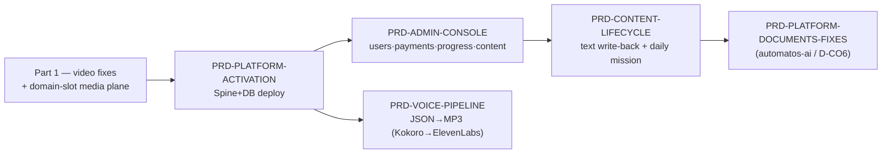

# Automatos Academy — Platform Architecture

The canonical reference for how content and data move across the three consumers of the Academy:
**Web/Mobile UI · the Mobile Tutor app · Automatos (KGs for the tutor + daily content generation).**
Written 2026-07-23 from a full read of `automatos-academy`, `automatos-academy-app`, and `automatos-ai`.

> **The headline:** ~80% of the unified plane is **already built but dormant**, gated on three switches —
> `DATABASE_URL` (Postgres), `SPINE_ENABLED=true` + prod Clerk, and the voice-generation pipeline.
> This is an *activation + fill-the-gaps* program, not a rewrite.

---

## 1. The three surfaces + one server

- **Web + mobile read the identical Content API** (`/api/catalog/*`, ETag'd) — `public/js/content.js` and `automatos-academy-app/src/content/client.ts`.
- **Automatos is academy-driven** — the platform has no academy-aware code; the academy pushes corpus in and reads inventory back.

---

## 2. Current state — what's live vs dormant

| Concern | Store | Access API | Status |
|---|---|---|---|
| Curriculum (canonical) | git `public/content/**` | Content API (files mode) | ✅ **live** |
| Curriculum (mirror) | Postgres `content_documents/versions/current` | Content API (db mode) | 🟡 built, **dormant** (`CONTENT_SOURCE=files`, no `DATABASE_URL`) |
| Videos | Widget CDN `widgets.automatos.app/academy/` | JSON urls + media overlay | ✅ **66 live** (via git-JSON publish) |
| Podcast audio | **git `.m4a`** (academy origin) | Content API `/podcasts` | ✅ live, but a **fork** (gitignore only blocks `.mp4/.mp3`) |
| TTS / read-aloud audio | (planned) CDN `academy/audio/<voiceKey>/<sha>.mp3` | media overlay `kind:audio` | ⛔ **generation unbuilt** |
| Profiles + progress | Postgres **Spine** (7+2 tables) + Clerk | `/api/me` · `/api/sync` | 🟡 built, **`SPINE_ENABLED=false`** |
| Progress mirror | web `localStorage` · mobile AsyncStorage+blobs | — | ✅ **primary today (per-device islands)** |
| Operational media urls | Postgres `media_bindings` + overlay | media plane | 🟡 built, **dormant** (mounted only under Spine) |
| Admin (users/payments/progress) | — | — | ⛔ **absent** (only media-upload exists) |

**The keystone:** the Spine (Clerk + Postgres) gates cross-device sync **and** the media admin plane **and** DB-served content. One deploy lights up three systems.

---

## 3. Target state — the unified plane

Three contracts, every surface reads them; the per-device forks close; all media (video + podcast audio + TTS) sits behind one `media_bindings` plane; curriculum ships from the DB without redeploys.

---

## 4. Content lifecycle — Automatos generates + reviews + verifies daily

**Must-build for the loop:** the platform tags-persist fix (🔴 below), the academy **text write-back API**, the **cert-watch mission**, and **composing the daily routine** (KG rebuild is manual — `knowledge_graph.py:102`).

**🔴 Critical break to fix first:** `automatos-ai/orchestrator/api/documents.py:206-218` parses `tags` but writes the row with `tags=` commented out ("SQLAlchemy array bug"). The corpus-sync's per-course tagging is **silently dead** → the tutor KG can't map chunks to their course.

---

## 5. Ingress / egress map — every content + data path

**Hygiene to close:** the academy holds an over-privileged `ORCHESTRATOR_API_KEY` (scoped keys rejected — D-CO6 #1); podcast audio leaks into git; two video-publish paths coexist (git-JSON vs bindings).

---

## 6. Admin console (net-new)

Replaces the binary `ACADEMY_ADMIN_CLERK_IDS` env allowlist with a real `users.role` column; **academy-native Stripe** (owner decision 2026-07-23) writes the `plan` column and gates track access.

---

## 7. Roadmap / sequencing

See `docs/prds/PRD-*.md` for each. **Owner decisions locked 2026-07-23:** academy-native Stripe · admin console is the first build after Part 1 (activation runs in parallel as owner env work).
