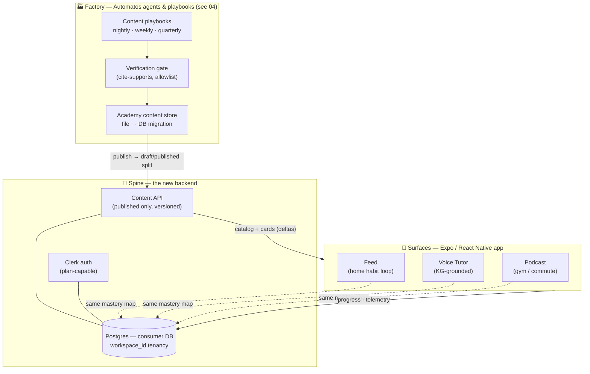
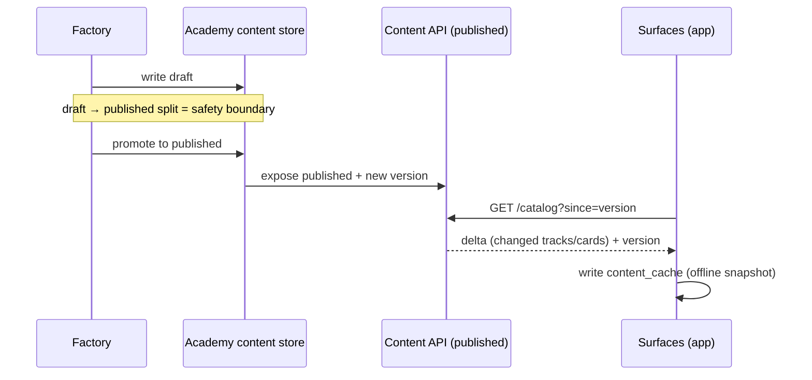
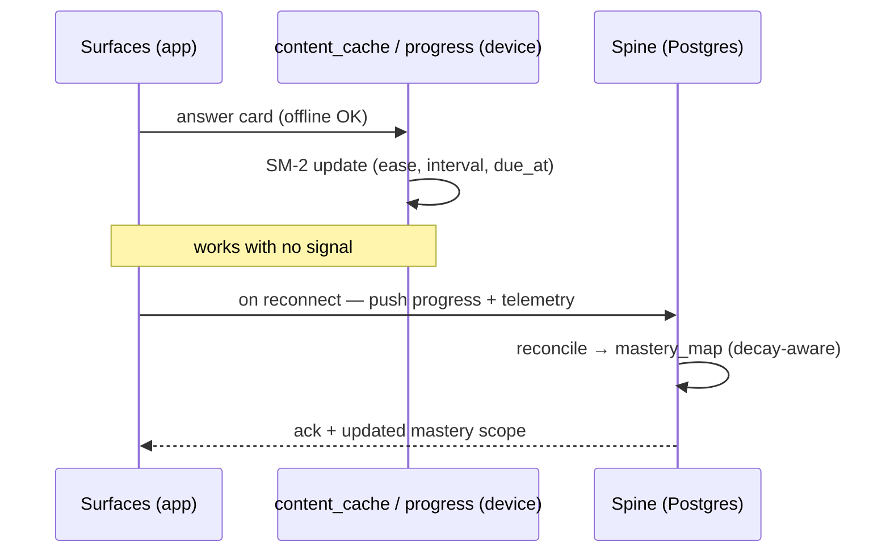

# 02 — Architecture

**Status:** Design draft — Week 1. Part of [00-INDEX](00-INDEX.md).

## 0. Scope of this doc

The three-tier system, the academy **Content API** contract, the Postgres data model, Clerk auth, offline/sync, and the stack recommendation. It answers *what the pieces are and how they exchange data* — not the learning math, not how content is made, not the screens.

**Excludes (hand-offs):** selector / mastery math → [`03-mastery-engine.md`](03-mastery-engine.md); factory internals, playbooks & the verification gate → [`04-content-factory.md`](04-content-factory.md); screen layouts & flows → [`05-ux-flows.md`](05-ux-flows.md).

## 1. Three tiers (Factory · Spine · Surfaces)

The app is a **catalog-driven client of the academy content service** [D3]. It never talks to the raw factory; it reads only *published* content through a versioned Content API, and reads/writes one shared mastery map.

- **Factory** — Automatos agents/playbooks generate and maintain content on a nightly / weekly / quarterly cadence. Owns the content store's file→DB migration and the verification gate. *Detailed in S04; referenced here only as the upstream producer.*
- **Spine** — the new backend: Postgres + Clerk auth + a published **Content API** + the per-user mastery map. Everything the app depends on server-side lives here.
- **Surfaces** — the Expo/React Native app. Three surfaces (Feed, Voice Tutor, Podcast), all reading and writing the **same mastery map**, so studying anywhere updates everything.

## 2. Content source — one contract, two consumers

The catalog is **dynamic and grows weekly** [D3]: all tracks, learning paths and levels, mirroring the academy's `pathfinder.js`. **Nothing is hardcoded to CCA-F** — CCA-F is only a *featured* flag for the pilot. New content appears with **no app release**.

The academy content is migrating **file → DB** [O5]. Today's JSON schema is the **shared contract** the DB migration must preserve and expose as the Content API. The table below is the **real shape of today's files** (F3) — corrected from an earlier draft that wrongly listed an inline `domains` array and inline `paths`/`levels` on `track.json`:

| Schema file (today) | Role — what it actually contains | Becomes (API) |
|---|---|---|
| `manifest.json` | catalog root: **vendors → tracks**, versions | `GET /catalog` (+ `version`, ETag) |
| `track.json` | one track's **exam spec**: `verification.sourceOfTruth`, **`domainFiles` (an array of *references* to per-domain files)**, `officialResources`, badge — **no inline `domains` array, no inline `paths`/`levels`** | `GET /catalog/{track}` |
| per-domain file | the domain body: domain `weight`, `questions` (each with `sourceRefs`), `lessons`, `scenarios` | `GET /catalog/{track}/{domain}` |

> **Why this matters:** §2 is the contract the migration must preserve, so it must describe the files as they are. `track.json` carries only *references* (`domainFiles`) to the per-domain JSON; domains, their `weight`, `questions`, `lessons` and `scenarios` all live in the per-domain files fetched at `GET /catalog/{track}/{domain}`. A client that expected an inline `domains` array on `track.json` would dead-end.

### Paths & levels — NEW content objects the migration must deliver (F1 / D6)

**Paths and levels do not exist in today's JSON** — `track.json` has no `paths`/`levels`, and `pathfinder.js` only emits a rule-based *ordered list of track ids*, not a catalog of named objects. Per **D6** they become **first-class NEW content objects delivered by the academy file→DB migration**, added to this contract as new object types:

| New object (D6) | Role | Becomes (API) |
|---|---|---|
| path | a named learning path spanning one or more tracks/domains; the unit `mastery_map.scope_type = 'path'` rolls up from | `GET /catalog/paths` (list) + `GET /catalog/paths/{path}` (its track/domain membership) |
| level | an ordered stage grouping tracks/paths (e.g. foundation → advanced) the app mirrors in the chooser | `GET /catalog/levels` (list) + `GET /catalog/levels/{level}` |

These are **not present in today's files** — they are new schema owned by the academy migration side, and the app is a **client of them once the migration ships them** (Stage-0 dependency, see [`07-roadmap.md`](07-roadmap.md) §3). Until they ship, the app has no source data for the `path`/`level` chooser branches or the `path` mastery scope.

**One contract, two consumers — do not fork it.** The web academy and the mobile app read the *same* published shape. The migration's job is to preserve the existing schema, add the new path/level objects, and serve it all dynamically; the app is a client, not a second source of truth. The versioning story mirrors `manifest.json` — the client holds a version and fetches **deltas**.

## 3. Data model (Postgres — its own consumer DB)

A dedicated backend DB for the Spine, **reusing the platform's `workspace_id` tenancy** (workspace-per-user). Seven tables.

> **Ids are only unique *within a track* (F4).** `store.js` keys everything by `(vendorId, trackId)` and academy item/domain ids are **not** globally unique — the same domain id can appear in two tracks. So every user-state table that references content carries a **`track_id`** (and **`vendor_id`**) column; equivalently, ids may be stored fully-qualified as `vendor/track/domain/item`. This is a primary-key-shaped decision made **now** — a multi-cert user (persona P3) would otherwise collide ids across tracks, and the per-domain rollup would not know which track's blueprint weight to apply.

### `users` — Clerk-linked identity
| column | type | notes |
|---|---|---|
| `id` | uuid pk | |
| `clerk_user_id` | text unique | maps to Clerk identity [D1] |
| `workspace_id` | uuid | tenancy key (workspace-per-user) |
| `plan` | text | `free` in pilot; plan-capable for post-pilot |
| `created_at` | timestamptz | |

### `mastery_map` — per-user competence vector (drives what gets served)
| column | type | notes |
|---|---|---|
| `user_id` | uuid fk | |
| `vendor_id` | text | track/vendor dimension (F4) — ids are unique only within a track |
| `track_id` | text | which track this scope belongs to (F4); a `path` scope may span tracks — see note |
| `scope_type` | text | `domain` \| `path` — rolls up **per-domain AND per-path** |
| `scope_id` | text | domain or learning-path id (unique only within `track_id`) |
| `competence` | float | 0–1 vector element, **stored raw** and **decayed on read** (see 03 §5) |
| `decay_at` | timestamptz | last-practice timestamp the decay curve is measured from (03 §5) |
| `updated_at` | timestamptz | |

*A `path` scope can span multiple tracks (D6); for a cross-track path, `track_id`/`vendor_id` identify the path's home catalog and its per-domain contributions carry their own `track_id`. `competence` is never written pre-decayed — the selector and gate apply the 03 §5 curve at read time using `decay_at`.*

### `progress` — SM-2 item state (mirrors academy `store.js`)
| column | type | notes |
|---|---|---|
| `user_id` | uuid fk | |
| `vendor_id` | text | track/vendor dimension (F4) |
| `track_id` | text | which track the item belongs to (F4) — item ids are unique only within a track |
| `item_id` | text | question / card id (unique only within `track_id`) |
| `seen` | int | exposures |
| `correct` | int | correct answers |
| `ease` | float | SM-2 ease factor |
| `interval` | int | days until next review |
| `due_at` | timestamptz | next-due date |

### `content_cache` — offline snapshot + version (delta sync)
| column | type | notes |
|---|---|---|
| `user_id` | uuid fk | |
| `scope_id` | text | track / domain snapshotted |
| `payload` | jsonb | published content snapshot |
| `content_version` | text | matches Content API version |
| `synced_at` | timestamptz | last delta sync |

### `telemetry` — events (feeds personalization + the factory loop)
| column | type | notes |
|---|---|---|
| `user_id` | uuid fk | |
| `vendor_id` | text | track/vendor dimension (F4), nullable for non-content events |
| `track_id` | text | which track the event belongs to (F4), nullable for non-content events |
| `event_type` | text | `answer` \| `card_outcome` \| `session` \| `scenario` — `scenario` carries branch progress (F17) |
| `item_id` | text | subject of the event (nullable; unique only within `track_id`) |
| `payload` | jsonb | answer events, card outcomes, session events; for `scenario`, `{scenario_id, step, scorePct}` (F17) |
| `created_at` | timestamptz | |

Telemetry feeds two loops: **personalization** (Spine → mastery map) and the **factory's improvement loop** (which items are weak / confusing → S04).

### `mock_attempts` — whole-exam attempts (mirrors `store.js` `exams`) — feeds the readiness gate (F6)
The readiness gate's Part-2 mock check (03 §4) needs whole-exam results that per-item `progress` can't represent. This mirrors `store.js`'s `exams: []` (`pushExam` / `bestMock` / `bestPassedMock`).

| column | type | notes |
|---|---|---|
| `user_id` | uuid fk | |
| `vendor_id` | text | track/vendor dimension (F4) |
| `track_id` | text | which track's mock (F4) |
| `scaled` | int | scaled score of the attempt |
| `passed` | bool | scaled ≥ the vendor pass mark |
| `at` | timestamptz | when the mock was taken |

The gate reads the best attempt per `(user_id, track_id)` to evaluate "a full mock ≥ vendor pass mark" (03 §4 Part 2).

### `scenario_progress` — branching-scenario state (feeds selector bucket 4) (F17)
Selector bucket 4 (stretch) leans on branching scenarios; domain files carry a `scenarios` array and `store.js` has `pushScenario` / `scenarioScore`, but per-item `progress` can't hold partial-branch state. Recorded here (a small dedicated table; equivalently the `telemetry` `scenario` event above for lighter-weight capture).

| column | type | notes |
|---|---|---|
| `user_id` | uuid fk | |
| `vendor_id` | text | track/vendor dimension (F4) |
| `track_id` | text | which track (F4) |
| `scenario_id` | text | scenario id (unique only within `track_id`) |
| `step` | int | current / furthest step reached through the branch |
| `score_pct` | float | partial score through the scenario |
| `updated_at` | timestamptz | |

## 4. Auth — Clerk [D1]

- **Clerk from day one, plan-capable.** Build auth and plan hooks now; the schema carries `plan`.
- **Pilot ships FREE.** No paywall, no IAP screens. Plans switch on **post-pilot** — a config/entitlement change, not a re-architecture.
- **Sign-in-with-Apple is required.** Any social login on iOS mandates it (App-Store rule) — see [`06-risks-compliance.md`](06-risks-compliance.md).
- **Shared identity with the academy** [D2] — same Clerk tenant; a user is one identity across web and mobile.

**Account deletion (GDPR right-to-erasure) — resolved (F8).** Because one Clerk identity spans academy + mobile [D2], "delete" has two distinct blast radii and the app exposes both:
- **Delete my Spine data** — the mobile app's own per-user rows (`mastery_map`, `progress`, `telemetry`, `scenario_progress`, `mock_attempts`, `content_cache`) are **independently deletable per user**, scoped by `user_id` / `workspace_id`, with no effect on the shared Clerk identity or the web academy. This is the app-local erasure path and satisfies right-to-erasure for the data the app owns.
- **Delete my whole account (Clerk identity)** — full identity deletion is a **separate shared cross-surface action** (it removes the identity used by both academy and mobile), gated behind **its own explicit confirmation** that names the cross-surface consequence. It is not the default "delete" inside the app.

This must be built into Stage 1 — see [`06-risks-compliance.md`](06-risks-compliance.md) §5. Deleting Spine data is always available; nuking the shared identity is the deliberate, separately-confirmed action.

## 5. Offline & sync

- **Feed + cards work fully offline** — cached published content (`content_cache`) + local SM-2 progress. Core habit loop needs no signal (gym, tube) [principle 5].
- **Progress syncs to the Spine when online** — local `progress` / `telemetry` reconcile to Postgres; conflict resolution below (F16/gap #8).
- **Voice Tutor needs connectivity** and must **degrade gracefully** in dead zones — a clear "reconnect for the live tutor" state, with Feed/cards still fully usable offline.

### Initial-sync / prefetch policy (F16)

Every screen except SC1/SC3 claims "fully offline," but `content_cache` starts **empty** — a user who completes onboarding (SC1) and immediately goes offline (the exact gym/tube moment the product targets) would otherwise find nothing cached. The first-run gap is closed by an **eager prefetch on scope selection**:

- **Trigger:** the moment SC1's chooser confirms a scope (track, path, or level — `05-ux-flows.md` SC1 node I/J), the app immediately begins fetching and caching the **active track's published content** — not the whole catalog, just what the newly-scoped selector will actually serve first.
- **What gets cached:** for the primary in-scope track(s), the full domain-file set (`GET /catalog/{track}/{domain}` for every domain, §2) — questions, lessons, scenarios — prioritized by `blueprintWeight` (heaviest domains first) so a truncated prefetch (slow network, user goes offline mid-download) still covers the highest-value material.
- **Size cap:** prefetch is **bounded**, not unlimited — cap at a fixed budget per track (first cut: **~25 MB per track**, tunable against real published-content sizes once the migration ships; text-only content — questions/lessons/scenarios JSON — is small, so this budget comfortably covers a full track without approaching mobile-storage pressure). Media-heavy content (audio/video clips, §4 of `04-content-factory.md`) is **not** part of this initial prefetch — it downloads on-demand or via the explicit "download for offline" action already specified for the Podcast surface (`05-ux-flows.md` SC4), keeping the mandatory first-run prefetch small and fast.
- **Additive scope (F9):** the same prefetch trigger fires again when a track is added via the additive re-entry flow (`05-ux-flows.md` SC1b) — the newly-added track gets prefetched the same way, on top of (not replacing) whatever is already cached.

This closes **F16**.

### Delta-sync conflict resolution (gap #8)

"Last-write per item" is not a complete rule once **decay** (F5, `03-mastery-engine.md` §2) and **multi-device use** are both in play. Two cases need an explicit merge, beyond the simple case of one device syncing one item once:

- **Same item, answered on two devices while both offline.** Each device's local `progress` row for that `item_id` (scoped by `track_id`, F4) advances its own SM-2 state independently. On reconnect, the Spine resolves by **most-recent `due_at`-relevant answer wins** — concretely, whichever local answer has the **later wall-clock timestamp** is treated as the authoritative next SM-2 state for that item; the earlier one is discarded rather than merged (SM-2 state doesn't average meaningfully — it's a state machine, not an accumulator). This is "last-write," made precise: the tiebreak is real device-clock time of the answer event, not sync-arrival order (a device that reconnects late but answered first must not overwrite a device that reconnected first but answered later).
- **`mastery_map` rollup computed on stale local data, then reconciled.** A device that has been offline for a while may compute a locally-*effective* (decayed) competence from a `decay_at` that is now behind the Spine's view (which may have already reconciled other devices' answers). The rule: **the Spine is the source of truth for `mastery_map` roll-ups; the device never pushes a computed `competence`/`decay_at` pair, only raw `progress`/`telemetry` events.** The Spine re-derives `mastery_map.competence` and `decay_at` from the authoritative, merged `progress` state (per the item-level resolution above) after every reconcile — so the roll-up is always computed once, server-side, from the winning item states, never merged as two competing pre-computed numbers. This sidesteps decay-reconciliation entirely: decay is applied to a single authoritative `competence`/`decay_at` pair, never merged from two.
- **Practical effect:** a device only ever sends `progress`/`telemetry` deltas (item answers, events) — never a computed mastery number — and only ever receives back an authoritative `mastery_map` snapshot post-reconcile. This keeps the merge logic entirely on the Spine side and avoids client-side mastery-map arithmetic ever needing to reconcile against another device's arithmetic.

This closes **gap #8**.

## 6. Publish / consume safety

The app reads **ONLY `published`** content via the versioned Content API. It never sees the raw factory pipeline. The **draft→published split is the safety boundary**: a bad nightly run lands in *draft* and cannot reach a user until it is promoted (and passes the S04 verification gate). Content is versioned like `manifest.json`; the client fetches deltas against its held version.

## 7. Stack — Expo / React Native (O1, recommend — pending confirm)

**Recommendation: Expo / React Native.** Marked **O1**; confirm before build.

- The academy's **pure-function engines port directly** — SM-2 (`store.js`) and blueprint-weighted readiness (`readiness.js`) are plain JS, reused as-is on device (see S03).
- `expo-notifications` — answerable pushes + scheduling (the daily nudge, U1).
- **Background audio** for the Podcast surface (U3).
- **Offline** — SQLite / MMKV + `expo-file-system` back `content_cache` and local progress.
- **OTA content via EAS** — content updates ship without an App-Store round-trip, matching the "new content, no app release" promise [D3].

**The OTA line: content *instances* vs content *types* (F12).** The "new content, no app release" promise holds for **content instances of a known shape** — new tracks, domains, cards, questions, scenarios, and now path/level objects (D6) arriving as **catalog data via the Content API (or an EAS data bundle)**. These need **no App-Store release**. But EAS Update ships JS/asset bundles, and Apple restricts OTA from *materially changing app behaviour/features*, so a **genuinely new content *type* or renderer is code, not data**: a new card *type*, a new scenario *renderer*, a new audio-player capability, or any new media type is a code change that **requires an App-Store release**. Do not use OTA to add features. The dynamic-catalog promise covers *instances of shapes the app already renders*; a new *shape* is a release.

**Alternative — Capacitor:** a **throwaway habit-validation prototype only**. It can wrap the existing web feed fast to test the doom-scroll loop, but it does not carry the native audio / notification / offline story and is **not** the production path.

## 8. Key decisions & rationale

- **Local cache + sync (not local-only, not server-only)** [O4] — the habit loop must survive dead zones (offline-first), yet Clerk is in from day one, so progress belongs to an account and follows the user across devices. Cache + reconcile gets both.
- **Expo / React Native** [O1] — maximises reuse of engines you already own (pure-function SM-2 + readiness), and gives native notifications, background audio and OTA content in one stack. Least new invention.
- **Separate consumer DB** — the Spine owns *user state* (mastery, progress, telemetry); the academy owns *content*. Keeping them apart lets content migrate file→DB on its own timeline while the app reads a stable contract, and reuses the platform's `workspace_id` tenancy without coupling to academy internals.
- **Draft→published split** — the safety boundary that stops a bad automated run reaching a learner. The app's read-only, published-only, versioned view of content is what makes an autonomous factory safe to point at users.

## 9. Conformance to locked decisions

| # | Reflected here |
|---|---|
| D1 | §4 — Clerk plan-capable, free-through-pilot, Sign-in-with-Apple |
| D2 | §1/§4 — academy companion, shared Clerk identity & brand |
| D3 | §2/§6/§7 — dynamic academy-fed catalog, CCA-F featured-only, OTA no-release (content instances vs types, F12) |
| D4 | this doc is flows/diagrams-first — no hi-fi |
| D5 | flows feed Claude Design / DesignSync downstream (S05) |
| D6 | §2 — paths & levels are NEW content objects delivered by the file→DB migration; the Content API contract includes them as new object types; the app is a client of them |
| D7 | readiness-gate storage supports D7: `mock_attempts` (F6) backs the full-mock check; gate *math* is [03 §4] |

## 10. Changelog — red-team fix-pass

Targeted edits applied from [`08-design-red-team.md`](08-design-red-team.md); good content preserved, D1–D7 conformance intact.

- **F3** — §2 Content API table corrected to the real file shape: `manifest.json` → `GET /catalog` (vendors→tracks); `track.json` → `GET /catalog/{track}` (exam spec, `verification.sourceOfTruth`, `domainFiles` *references*, `officialResources`, badge — **no** inline `domains` array, **no** inline paths/levels); per-domain file → `GET /catalog/{track}/{domain}` (domain `weight`, `questions` w/ `sourceRefs`, `lessons`, `scenarios`). Closes **F3**.
- **F1 / D6** — §2 adds paths & levels as **new content objects the migration must deliver** (`GET /catalog/paths`, `GET /catalog/levels`), explicitly flagged as *not in today's JSON*; app is a client once shipped. Closes **F1** (arch side).
- **F4** — §3 adds `track_id` + `vendor_id` to `mastery_map`, `progress`, and `telemetry` (ids unique only within a track); new-table columns carry them too. Closes **F4**.
- **F6** — §3 adds `mock_attempts` (`user_id`, `vendor_id`, `track_id`, `scaled`, `passed`, `at`), mirroring `store.js` `exams`; the gate's mock check reads it. Closes **F6**.
- **F17** — §3 adds `scenario_progress` (branch `step` + `score_pct`) plus a `telemetry` `scenario` event type, giving the selector's stretch bucket a home for scenario state. Closes **F17**.
- **F8** — §4 states the account-deletion resolution: Spine data independently deletable per-user; full Clerk-identity deletion is a separate, separately-confirmed cross-surface action. Closes **F8** (arch side; 06 §5 mirrors).
- **F12** — §7 draws the OTA line: content *instances* of known shape ship via OTA/data with no release; new content *types* or renderers are code and need an App-Store release. Closes **F12**.
- **F16** — §5 adds an initial-sync/prefetch policy: on scope selection (SC1 confirm), eagerly cache the active track's domain-file content, `blueprintWeight`-prioritized, bounded to a named size cap (~25 MB/track, text-only), so the first offline session isn't empty; media (audio/video) stays on-demand/explicit-download, not part of this prefetch. Also fires on additive scope changes (F9). Closes **F16**.
- **Gap #8** — §5 defines delta-sync conflict resolution beyond "last-write per item": same-item-two-devices-offline resolves by later wall-clock answer timestamp (not sync-arrival order); `mastery_map` roll-ups are never merged client-side — devices only ever push raw `progress`/`telemetry`, and the Spine re-derives `competence`/`decay_at` server-side from the winning item states after every reconcile, so decay reconciliation never has to merge two competing pre-computed numbers. Closes **gap #8**.
