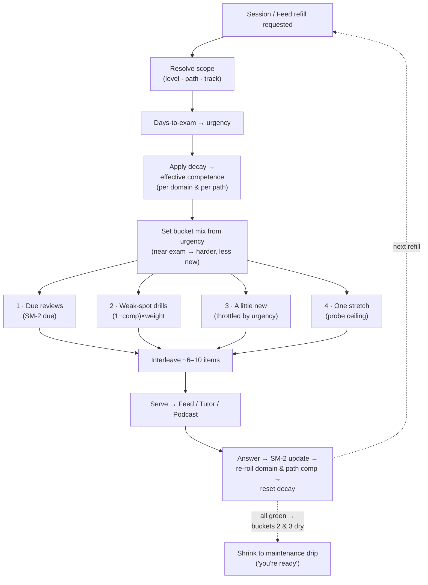

# 03 — Mastery engine

**Status:** Design draft — Week 1. Part of [00-INDEX](00-INDEX.md).

## 0. Scope of this doc

The **learning math** behind every surface: the two-level mastery model (item-level SM-2 rolled up to domain/path competence, with decay), the **adaptive selector** that assembles each session from four buckets, and the **readiness gate**. It answers *what to serve next, and when the user is honestly ready* — not where state is stored, not how the readiness screen looks.

The Feed, Voice Tutor and Podcast all pull their next items from the **one selector** described here, writing back to the **same mastery map** [00-INDEX §"One engine, three surfaces"], so studying anywhere updates everything.

**Excludes (hand-offs):** storage/schema — `mastery_map`, `progress` tables → [`02-architecture.md`](02-architecture.md) §3; the readiness *screen* & its journey → [`05-ux-flows.md`](05-ux-flows.md).

## 1. What already exists vs. what's new

Part of the brain is **already built as pure functions in the academy** and ports directly to device [02 §7]:

- **`store.js`** — item-level **SM-2** spaced repetition: per item it tracks `seen / correct / ease / interval / due`. Reused as-is; it maps 1:1 onto the `progress` table [02 §3].
- **`readiness.js`** — blueprint-**weighted competence computation**: it computes a per-domain weighted competence and reports an aggregate (with an A+ tier at ≥ 800/1000 **and** ≥ 90% weighted). **Reused for the per-domain weighted-competence *computation* only** — *not* as the readiness gate. Verified: `readiness.js` has **no per-domain floor** (the weakest domain is *reported*, never *gates* the verdict) and its only qualifying bar is aggregate A+.

**Genuinely new logic (this doc):** (1) the **4-bucket adaptive selector**; (2) **per-path** rollup (paths span multiple tracks/domains, sourced from the new path content objects [D6]); (3) **decay-driven maintenance** so strong domains are never forgotten; (4) the **readiness gate** — the **per-domain floor** (every in-scope domain ≥ ~85% weighted competence) **AND** the **full-mock ≥ vendor pass mark** check (D7). The gate is **NEW logic built on top of `readiness.js`**, not a reuse of it: `readiness.js` supplies the per-domain competence numbers the gate reads, but the floor-across-all-domains rule and the mock-gate are new here. Everything else is porting engine logic already owned.

## 2. Two-level mastery model

### Level 1 — item (SM-2, from `store.js`)

Each question/card carries SM-2 state (`seen / correct / ease / interval / due`). On every answer: correct → `ease` nudges up, `interval` lengthens, `due` pushes further out; wrong → `interval` collapses toward "soon", `ease` drops. This is the existing academy math, unchanged.

### Level 2 — competence, rolled up per-domain AND per-path (with decay)

Item states roll up to a **competence** value in [0,1] per scope, using `readiness.js`'s blueprint-weighted average — items in heavily-weighted domains count more.

- **Rolls up twice.** `scope_type = domain` and `scope_type = path` [02 §3 `mastery_map`]. A **path spans multiple tracks/domains** [01 §7], so its competence is the weighted roll-up across every domain the path touches. **The path scope's membership sources from the new path content objects** [D6, 02 §2] — a path is now a real catalog object (`GET /catalog/paths/{path}`) that enumerates the tracks/domains it touches, so the roll-up has concrete source data. A path can be red while its individual domains are mixed.
- **Decay (new).** Competence is **not** a frozen high-water mark. Each scope carries a `decay_at`; as real time passes without practice, effective competence **drifts down**, so a domain that was green months ago resurfaces for a light touch. This is what guarantees strong domains earn **occasional maintenance and are never forgotten** — it mirrors SM-2's forgetting curve one level up. Answering in a domain resets its decay and lifts competence again.

### The decay function (first cut, F5)

Decay is 100% new (no decay exists in `store.js`/`readiness.js`). First-cut specification a build agent can implement:

- **Curve — exponential drift toward a floor.** `effective = floor + (stored − floor) · exp(−λ · Δt)`, where `Δt` = time since `decay_at` and `floor` is a small residual (competence never rots to zero — a once-learned domain retains a baseline). A domain relaxes from its stored value toward `floor` as time passes without practice.
- **Half-life is a function of `blueprintWeight`.** `λ = ln 2 / halfLife`, with **`halfLife = f(blueprintWeight)`**: heavily-weighted (exam-important) domains decay **faster** so they resurface for maintenance sooner; light domains decay slower. (First cut: a longer half-life for low-weight domains, shorter for high-weight — tune against pilot data.)
- **Stored raw, decayed on read.** `mastery_map.competence` is **stored raw** (the high-water value) and **decayed at read time** using `decay_at` [02 §3]. Nothing writes a pre-decayed value; the selector and the gate compute effective competence on read. Answering resets `decay_at` to now and updates the raw `competence`.

> **Effective competence** = raw stored competence relaxed toward `floor` per the curve above, measured from `decay_at`. The selector and the gate always read *effective* competence, never the raw stored value.

### READY → NOT-READY transition (F5 — trust & liability)

Because the gate reads effective (decayed) competence, a user who cleared the gate then went quiet can drift back below the domain floor. **This must never be a hard, silent un-ready** — the user may already have *booked the real exam*, and flipping a bare "not ready" is a trust-and-liability failure. Rule: once a user has ever been READY, the surface shows **"you were ready on {date}; a refresh is recommended"** (a soft, dated, non-alarming maintenance prompt with the specific decayed domain named), **not** a bare red "NOT READY". The maintenance drip [§3] resumes to close the gap; the honest verdict stays honest without pretending the earlier ready state never happened.

## 3. The adaptive selector (the new core)

Every session — and every Feed refill — assembles **~6–10 items** from **four buckets**. The mix is **weighted by exam-date proximity**: the closer the exam, the harder the push — **more weak-spot drilling, more difficulty, less new material**. Far from the exam, the mix leans exploratory and gentle.

### The four buckets

1. **Due reviews** — SM-2 `due` items (from `progress`). Protects solid areas from decay; these are the maintenance reps that keep green domains green.
2. **Weak-spot drills** — the deliberate-practice core. Rank candidate domains by **`(1 − effective competence) × blueprintWeight`** and drill items from the top-ranked (weak *and* exam-important) domains first.
3. **A little new material** — unseen items, to keep moving forward. **Throttled by exam-date `urgency` and competence** — as the exam approaches (high urgency), new material is cut back in favour of buckets 1 & 2. (There is no "study plan / pace target" in the package — throttling gates purely on urgency + competence, the only inputs that exist. F11.)
4. **One stretch item** — a single harder question or a branching-scenario step, to **probe the ceiling** and surface hidden weakness before the exam does.

### Selection loop — plain numbered steps (no code)

1. **Resolve scope.** Take the user's active level / path / track [01 §7]; collect every domain in scope (+ every domain a selected path touches — path membership comes from the path content object, `GET /catalog/paths/{path}` [D6, 02 §2]).
2. **Read exam proximity.** Compute days-to-exam (if an exam date is set) → an `urgency` factor: far = low, near = high.
3. **Refresh effective competence.** For each in-scope domain and path, apply decay since `decay_at` to get *effective* competence.
4. **Set the bucket mix.** From `urgency`, choose target counts across the four buckets so they sum to the session size (~6–10):
   - low urgency → more **new** (3), fewer weak-spot (2), reviews as due, 1 stretch;
   - high urgency → more **weak-spot** (4–5), **new** throttled to 0–1, reviews as due, 1 stretch.
5. **Fill bucket 1 (due).** Pull SM-2 `due` items, most-overdue first, up to its target.
6. **Fill bucket 2 (weak-spot).** Rank in-scope domains by `(1 − effective competence) × blueprintWeight`; take items from the top domains until the target is met.
7. **Fill bucket 3 (new).** Add unseen items up to the (urgency-throttled) target; when urgency throttles new material down, borrow the freed slots into bucket 2 (weak-spot). (Gated on urgency + competence only — no plan/pace signal. F11.)
8. **Fill bucket 4 (stretch).** Add exactly one harder item / scenario step (scenario-step state stored in `scenario_progress` [02 §3]), preferably from a domain that is *mid-range* (not hopeless, not mastered) to get signal.
9. **Order & serve.** Interleave (not blocked by domain — interleaving beats blocking for retention); serve to whichever surface asked (Feed card, Tutor drill, Podcast recall bridge).
10. **Write back.** Each answer updates SM-2 item state → re-rolls domain **and** path competence → resets that scope's decay. Telemetry logged for the factory loop [02 §3].

### The app backs off itself (decay-driven maintenance)

As domains go green, buckets 2 and 3 **run dry** (few weak spots, little unseen left). The session **shrinks toward bucket 1 only** — a small maintenance drip governed by decay. The product voice becomes *"you're ready — I'll stop nagging,"* surfacing a domain only when its decay pulls it back below par. Humane-habit, not habit-trap [01 §4.4].

## 4. Readiness gate — NEW logic (D7), not "reuse"

This gate is **new logic on top of `readiness.js`** (§1) — `readiness.js` supplies the per-domain weighted-competence *numbers*, but the per-domain **floor** and the **mock gate** are new here. **Ready is a hard, two-part AND** — no single number can hide a blind spot:

> **READY** ⇔ **every in-scope domain ≥ ~85% weighted competence** **AND** a **full mock ≥ the vendor pass mark** (D7).

- **Part 1 — every domain clears the floor (NEW).** Every in-scope domain must reach **≥ ~85% weighted competence**. The per-domain *number* is `readiness.js`'s blueprint-weighted competence; the **floor-across-all-domains rule is new** — `readiness.js` itself only *reports* the weakest domain, it never *gates* on it. A high *average* with one weak domain is **NOT** ready — the weakest domain gates the verdict. (`readiness.js`'s aggregate A+ tier, ≥ 800/1000 **and** ≥ 90% weighted, is a stronger "over-prepared" signal *above* this floor, not the gate itself.)
- **Part 2 — a real full-length mock (NEW gate).** A complete mock exam under exam conditions must score **≥ the vendor's actual pass mark**, read from `mock_attempts` (best attempt per track) [02 §3, F6]. Drills alone never flip the gate; you must pass the whole thing once.
- **Effective competence.** Part 1 reads the **same effective (decay-adjusted) competence** as the selector [§2] — so a user who cleared the gate then went quiet can drift below the floor; the READY→NOT-READY transition rule [§2] applies (soft "was ready on {date}; refresh recommended", never a bare silent un-ready) and maintenance nudges resume.
- **Honest output.** Always name the headline number **and the weakest domain**, e.g. *"87% ready; weakest domain D2 (68%)."* Never a bare green tick. The disclaimer is a feature [01 §8]: *we get you ready; the official practice exam confirms it.*

## 5. Worked example — "87% ready, weakest D2"

A CCA-F learner, exam in 9 days (high urgency), five domains D1–D5:

| Domain | blueprintWeight | effective competence |
|---|---|---|
| D1 | 0.15 | 0.91 |
| D2 | 0.30 | 0.68 |
| D3 | 0.20 | 0.88 |
| D4 | 0.20 | 0.90 |
| D5 | 0.15 | 0.93 |

- **Weighted competence** = Σ(weight × comp) = .15·.91 + .30·.68 + .20·.88 + .20·.90 + .15·.93 ≈ **0.84 → shown as "87% ready"** (headline blends weighted competence with mock performance; illustrative).
- **Weak-spot ranking** `(1 − comp) × weight`: D2 = .32·.30 = **.096** (top), D3 = .12·.20 = .024, D4 = .10·.20 = .020… → **D2 dominates the drill queue**.
- **Bucket mix (high urgency):** ~2 due reviews, **4–5 weak-spot (mostly D2)**, **0–1 new** (throttled by urgency — exam near [F11]), **1 stretch** (a mid-range D3 scenario step).
- **Gate verdict (D7):** **NOT READY** — D2 at 0.68 is below the ~0.85 per-domain floor (Part 1 fails) even before checking the mock. Honest line: *"87% ready; weakest domain D2 (68%) — clear D2 and pass one full mock."*
- **A week later**, D2 practice lifts it to 0.87, **every domain now ≥ ~0.85** (Part 1 passes), and a full mock in `mock_attempts` scores **above the vendor pass mark** (Part 2 passes) → **READY**. New material stayed throttled near-zero all week on urgency alone [F11]; the session budget went where it moved the gate.

## 6. Grounding & conformance

- **SM-2 math** = existing `store.js` (`seen / correct / ease / interval / due`), 1:1 with the `progress` table [02 §3]. **Not reinvented.**
- **Per-domain weighted competence *computation*** = existing `readiness.js` (blueprint-weighted; aggregate A+ ≥ 800/1000 + ≥ 90%). **Reused for the number only** — see next bullet.
- **The readiness gate is NEW logic, not reuse (D7, F2).** The per-domain **floor** (every in-scope domain ≥ ~85%) and the **full-mock ≥ vendor pass mark** check are new here; `readiness.js` reports the weakest domain but never *gates* on it. Stated once in §4; §1 lists the gate under "genuinely new logic."
- **New here:** the 4-bucket selector, per-path rollup (path membership from the new path content objects [D6]), decay-driven maintenance (decay function §2, F5), and the readiness gate (§4, D7).
- **Scopes** match `mastery_map.scope_type ∈ {domain, path}` exactly [02 §3]; competence is the `competence` float (stored raw, decayed on read [§2, F5]), decay measured from `decay_at`; the `path` scope has real source data from the D6 path objects. `mock_attempts` [02 §3, F6] backs the gate's Part 2.
- Serves all three surfaces from one selector into one mastery map [00-INDEX]; active-recall-first [01 §4.1]; humane soft-stop [01 §4.4]; honest readiness [01 §8, U7].

## 7. Conformance to locked decisions

| # | Reflected here |
|---|---|
| D1–D5 | inherited from 00-INDEX; this doc is engine math (flows/diagrams-first, no hi-fi) |
| D6 | §2/§3/§6 — the `path` scope's membership sources from the new path content objects (`GET /catalog/paths/{path}`); the roll-up now has real source data |
| D7 | §1/§4/§5/§6 — the readiness gate is the D7 definition (every in-scope domain ≥ ~85% weighted competence AND a full mock ≥ vendor pass mark), stated once as **NEW logic on top of `readiness.js`**, not reuse |

## 8. Changelog — red-team fix-pass

Targeted edits applied from [`08-design-red-team.md`](08-design-red-team.md); good content preserved, D1–D7 conformance intact.

- **F2 / D7** — the readiness gate (§4) is set to D7's single definition (every in-scope domain ≥ ~85% weighted competence AND full mock ≥ vendor pass mark). Moved into §1's "genuinely new logic" list; §1, §4 and §6 no longer call the gate "reuse" — `readiness.js` supplies the per-domain weighted-competence *computation*, the per-domain floor + mock gate are NEW. §5 worked example reconciled (D2 fails the ~0.85 floor; mock read from `mock_attempts`). Closes **F2**.
- **F5** — §2 specifies the decay function (exponential drift toward a `floor`, `halfLife = f(blueprintWeight)`), states `competence` is **stored raw and decayed on read** via `decay_at`, and adds the READY→NOT-READY rule (never a hard silent un-ready — "was ready on {date}; refresh recommended"). Closes **F5**.
- **F11** — removed all "behind their plan / schedule slipped" gating from the selector (bucket 3, steps 4/7, diagram node, §5): new-material throttling now gates purely on exam-date `urgency` + competence, the only inputs that exist. Closes **F11**.
- **F1 / D6** — §2/§3/§6 note the `path` scope's membership sources from the new path content objects (D6), giving the roll-up real source data. Closes **F1** (engine side).
