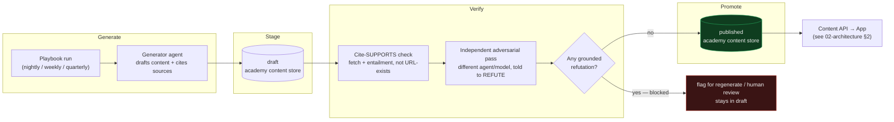

# 04 — Content factory

**Status:** Design draft — Week 1. Part of [00-INDEX](00-INDEX.md).

## 0. Scope of this doc

How the academy's content stays fresh and trustworthy without a human in the loop: the Automatos playbooks that generate it, the cadence they run on, the full content-type catalogue, the verification gate that stands between "generated" and "published," source-allowlist governance, and the observability that keeps the factory honest about its own health.

**Excludes (hand-offs):** how the app renders any of this content → [`05-ux-flows.md`](05-ux-flows.md); the app's own data model (mastery, progress, telemetry) → [`02-architecture.md`](02-architecture.md). This doc is upstream of both — it is the producer; the Spine's Content API (§2 of `02-architecture.md`) is the only thing the app ever talks to.

## 1. Where this sits (recap from 02-architecture)

The Factory is the top tier of the three-tier system. It never talks to the app directly — everything it produces lands in the academy content store as `draft`, passes through the verification gate, and only then is promoted to `published`, at which point the Spine's Content API exposes it as a versioned delta. That draft→published split is the safety boundary that makes an autonomous factory safe to point at learners; this doc is entirely about what happens *before* that line.

*Generate → verify → stage → promote.* Nothing skips the gate — including quarterly graded-bank content, which gets the same gate plus the higher interpretive-content bar (§5).

## 2. Cadence — automate the ephemeral, gate the graded

The core policy: **the lower the stakes, the higher the automation; the higher the stakes, the more re-verification before anything touches a real exam attempt.** Nightly output feeds a scroll — wrong once, low cost. Quarterly output feeds a mock exam a learner trusts as a readiness signal — wrong once, the trust model in [`01-vision-usecases.md`](01-vision-usecases.md) §8 breaks.

| Cadence | Feeds | What runs | Stakes |
|---|---|---|---|
| **Nightly** | The Feed | Fresh facts, news → exam cards, 30–60s clips | Low — ephemeral, high-volume, self-correcting over time |
| **Weekly** | The Podcast | One new episode as the underlying tech moves | Medium — long-form, but framed as commentary/explanation, not a graded artifact |
| **Quarterly / triggered** | The graded exam bank | Re-verify against source-of-truth via a **cert-watch mission** — not a nightly job | High — feeds mock exams and the readiness gate ([`03-mastery-engine.md`](03-mastery-engine.md)); errors here directly undermine the "you're ready" verdict |

The quarterly cadence is a floor, not a ceiling: a cert-watch mission can trigger an out-of-cycle re-verification the moment a vendor updates a blueprint or study guide (the same mechanism as source-drift auto-invalidation, §4.3) — it does not wait three months to notice a source changed underneath it.

## 3. Content-type catalogue

| Content type | Description | Generation path | Cadence |
|---|---|---|---|
| Flashcards | Question/answer recall pairs | Generator agent | Nightly / quarterly (graded variants) |
| 30–60s clips | Short video explainer | NotebookLM | Nightly |
| Podcasts | 40–50 min, chaptered episode | NotebookLM | Weekly |
| — chaptered short audio cards | Per-chapter audio excerpts cut from the podcast | Derived from podcast | Weekly (with podcast) |
| — Whisper transcript | Full transcript; feeds the KG and enables the **recall bridge** (2–3 questions after an episode, U3) | Derived from podcast audio | Weekly (with podcast) |
| Cheat-sheets | One-page domain summary | Generator agent | Nightly refresh / quarterly re-verify |
| Multiple explanations per concept | ELI5 / technical / analogy — served by the wrong-answer signal | Generator agent | Nightly |
| Mnemonics | Memory aids for hard-to-retain facts | Generator agent | Nightly |
| Mind-maps / infographics | Visual concept maps | NotebookLM | Nightly / weekly |
| Shareable carousels / slide-decks | Social/growth-facing content, doubles as study material | NotebookLM | Nightly / weekly |
| Audio-flashcards | Hear-question, pause, hear-answer | Generator agent (TTS) | Nightly |
| Mock-exam variants | Full-length practice exams | Generator agent | Quarterly / triggered |
| News → exam cards | Current events reframed as exam-style questions | Generator agent | Nightly |

Every row above still passes the gate in §4 before promotion — the catalogue describes *what* gets made, not an exemption from *how* it gets verified.

## 4. The verification gate (the crux)

The gate is what makes an autonomous, no-human-in-the-loop factory safe to point at a real learner. It has three mechanisms plus one governance layer (source allowlist, §5). All three run — this is not a menu.

### 4.1 Cite-SUPPORTS, not cite-exists

The lazy version of source-grounding checks that a citation URL resolves (HTTP 200) and stops there — a citation to the *right domain* with the *wrong claim* passes. The gate instead **fetches the allowlisted page and checks entailment**: does the source, as it reads today, actually support *this exact claim*, not just a claim in the same neighborhood? A citation that resolves but doesn't back the specific assertion is a fail, identical in outcome to a broken link.

### 4.2 Independent + adversarial

The validator is **a different agent or model from the generator**, and its brief is not "check this" — it's **"try to REFUTE this."** Adversarial framing surfaces the failure mode same-model self-review misses: a model rarely catches its own confident, fluent hallucination when asked to merely confirm it, but is much more likely to when explicitly incentivized to find the crack.

**Rule: any grounded refutation on a graded question blocks promotion.** Not "flag for review" — blocked, full stop, stays in draft. Non-graded content (Feed cards, clips) can use a softer flag-for-regeneration path since the stakes differ (§2), but graded content gets the hard block.

### 4.3 Source-drift auto-invalidation

Sources move out from under content that was correct when generated. The gate defends against this with a **dependency graph from source → derived content**:

- Every published item stores its **source URL(s) + a content hash of the cited passage** at verification time.
- A nightly job **re-hashes every stored source**.
- When a source's hash changes, **every downstream item grounded on it auto-flags for re-validation** — not just the item that cited it directly, but everything the dependency graph shows as derived from it (a podcast transcript quote, a flashcard built from that transcript, a mock-exam question built from the flashcard).

This is exactly the shape of problem a knowledge graph is built for — provenance-as-edges, cascading invalidation on a changed node — and is the concrete reason the KG earns its place in this pipeline rather than being decorative. It is the same instinct as `content_cache`'s version/delta model in `02-architecture.md` §3, one layer upstream: there, the client tracks "what changed since my version"; here, the factory tracks "what breaks if this source changed."

### 4.4 Interpretive content gets a higher bar

Not everything is a citable fact. Branching-scenario verdicts ("best," "viable," "wrong" for a given course of action) are **judgment calls**, not entailment-checkable claims — cite-SUPPORTS has nothing to fetch and check against. This content routes to a **higher bar**: an agent panel (multiple independent models voting/discussing) or a human spot-check, rather than the standard automated gate. Every published item is **labelled by its grounding confidence** so the app (and eventually the learner, via provenance — §6) can distinguish "directly cited, entailment-checked" from "expert judgment, panel-reviewed."

### 4.5 Audio/video inherits its transcript's grounding, plus a synthesis-fidelity check (F7)

Cite-SUPPORTS (§4.1) checks *text*. Audio/video content (NotebookLM clips, podcasts, TTS audio-flashcards) is never itself fetched and entailment-checked as audio — instead, **it inherits the grounding of the verified transcript it was generated from.** This is only valid because the pipeline is one-directional and scoped: audio/video generation in this factory is **derived-from-already-published-text only** — the source is a transcript, script, or card that has *already* cleared the gate in §4.1–§4.3 before synthesis ever runs. There is no audio/video path that skips text verification and gets grounded some other way.

Inheriting a text verdict is necessary but not sufficient — a correct transcript can still be **mis-synthesized**: wrong emphasis, a mispronounced term that changes meaning (e.g. a TTS engine flattening "not" or garbling an acronym), a clipped sentence at a chapter boundary. Nothing in §4.1–§4.3 catches this, because nothing there ever listens to the output. The gate adds one more step for synthesized audio/video specifically:

- **Synthesis-fidelity spot-check.** A sampled pass (not every clip, every run) that compares the synthesized audio/video back against its source transcript — automated where feasible (re-transcribe the output, diff against source), spot-checked by the same adversarial-validator discipline (§4.2) where automated re-transcription isn't practical for the format.
- **Label it.** Every audio/video item carries a grounding label distinct from pure-text items — e.g. *"grounded: source transcript verified; synthesis spot-checked"* — so the app and the learner (§6 provenance) can see this is a derived-format guarantee, not an independent entailment check of the audio itself.

This closes **F7(1)**.

### 4.6 News → exam cards ground on the evergreen concept, not the news URL (F7)

News → exam cards (§3, nightly) turn current events into exam-style questions, but the allowlist (§5) is **vendor-official docs only** — a news item is never on it, and never will be. To be clear about how these cards pass the gate at all: **a news → exam card is grounded on the evergreen vendor-doc concept the news item illustrates, not on the news URL.**

Concretely: the generator identifies which allowlisted, vendor-official concept a piece of news is an example of (e.g. a headline about a new model release becomes a question testing the underlying, already-documented concept it demonstrates — a context-window tradeoff, a governance principle, a pricing mechanism — not a claim about the headline event itself). The citation attached to the card, and the one cite-SUPPORTS checks, is **the allowlisted source for that concept** (§5) — the news item is only ever the *prompt/inspiration* for which concept to test, never a cited or citable source in the card itself.

**A build agent must not add news domains to any track's allowlist.** The allowlist stays vendor-official-only (§5); news → exam card generation is a distinct prompt pattern ("find the evergreen concept this illustrates, cite that") layered on top of the same §4.1 entailment check against the same allowlisted sources — not a second, looser source class.

This closes **F7(2)**.

## 5. Source allowlist — governance, not just a list

The allowlist is read **per-track** from `track.json.verification.sourceOfTruth` — already live in the schema today (confirmed in the shipped tracks, e.g. `cca-f/track.json` and `gh-300/track.json`: a flat `sourceOfTruth` list — a mix of external URLs and local reference docs, e.g. an exam-guide PDF path — alongside a `verifiedAt` date and free-text `notes`). The gate validates only against these authoritative, vendor-official targets — Anthropic docs, Microsoft/GitHub Learn, Google, IAPP, and equivalents per track. Nothing else counts as a citation target, regardless of how reputable it looks. (A separate, richer `officialResources` array with per-resource metadata already exists in some tracks — it is a distinct field from `verification.sourceOfTruth` and is not itself the gate's allowlist.)

**Treat the allowlist as security-sensitive, versioned, governed configuration — not a content-team convenience list.** Anything added to it becomes something the entailment check will trust and cite as ground truth for every downstream item on that track. A compromised or careless addition is a direct content-injection vector into every mock exam and recall card built on that track from that point forward. Concretely, this means:

- Changes to any track's `sourceOfTruth` go through the same review discipline as a security-relevant config change — not a content-ops edit.
- The allowlist is versioned per track (mirroring the existing `verifiedAt` field), so a compromised or bad addition is traceable and revertible.
- The gate itself has no path to cite anything **not** on the list — there is no fallback to "the model's general knowledge" or an unlisted-but-plausible-looking URL.

## 6. Provenance is a user feature, not just an audit trail

Every published item carries its source forward — **"source: Anthropic docs ↗"** on the card, not buried in a log. This closes two loops at once: it's the trust-model UI element already specified in [`01-vision-usecases.md`](01-vision-usecases.md) §8 ("verify against official docs ↗"), and it's the factory's legal cover — every item is demonstrably grounded-original, tied to a real citation and entailment check, not a brain-dump the non-goals in `01-vision-usecases.md` §10 explicitly rule out.

## 6.5 Voice Tutor KG retrieval contract (gap #13)

The Voice Tutor is described elsewhere as "KG-grounded" (`01-vision-usecases.md` §3, `06-risks-compliance.md` §6) and this doc's dependency graph (§4.3) is itself KG-shaped — but no doc states what the KG actually holds or how the tutor queries it at runtime. Short version, so the mechanism isn't a black box across the package:

- **What the KG holds.** Nodes are published content items (questions, lessons, transcript chapters, cheat-sheet sections) and their allowlisted source passages (§5); edges are the same provenance/dependency relationships §4.3 already tracks — "derived from," "cites," "covers domain/concept." The KG is built and maintained by the Factory as a byproduct of §4.3's source→content dependency graph, not a separate system — it's the same graph, read at query time instead of only at invalidation time.
- **How the tutor queries it at runtime.** A spoken question is resolved to the nearest matching concept node(s) in the KG (semantic match against node content/labels); the tutor's answer is generated **grounded in that node's already-verified content and its attached source citation** — the same allowlisted source the node cleared the gate against originally. The tutor never generates an answer from unconstrained model knowledge; if no node matches closely enough, the answer is "I don't know" (`01-vision-usecases.md` principle 3, `05-ux-flows.md` SC3 node N), not a best-effort guess.
- **Grounding is online-only.** The KG lives server-side as part of the published Content API surface — it is not shipped into `content_cache` for offline query. Per `02-architecture.md` §5, the live Voice Tutor loop needs connectivity; offline, the tutor is unavailable and the app shows the explicit degrade state (`05-ux-flows.md` SC3 node X), never a locally-approximated or unverified answer.

This closes **gap #13**.

## 7. Factory observability & alerting

The entire content supply chain — Feed, Podcast, and ultimately the graded exam bank the readiness gate depends on — rides on these playbooks running on schedule. **A playbook that stops running without anyone noticing is content quietly going stale in front of learners who have no way to know it.**

The concrete lesson behind this section: a prior live automation line went unfunded (LLM API credits ran out) and kept returning failures for an extended period before anyone caught it — not because the code broke, but because **nothing was watching whether the line was actually healthy versus quietly dormant.** A dashboard that shows green regardless of whether a line is running or has been silently unfunded/paused for weeks is the actual failure mode — worse than an honest red, because it hides the need to act. The fix is not "prevent playbooks from ever failing" (they will — funding lapses, upstream API changes, transient errors); it's **making failure and dormancy loud instead of invisible.**

Concretely, for every playbook (nightly / weekly / quarterly / triggered cert-watch):

- **Alert on missed runs**, not just failed ones — a schedule that silently stops firing is indistinguishable from success unless something checks "did this run when it was supposed to?"
- **Alert on failed runs** — distinct from missed runs; a run that fired but errored (auth, funding, upstream change) needs its own signal.
- **Never let a stale/dormant line report as healthy.** Status must distinguish *running*, *dormant/paused*, and *failing* — collapsing dormant into "green" is exactly the trap that let a real line go unnoticed.
- **The gate's block rate is itself a signal.** A sudden spike in adversarial-validator refutations or source-drift re-flags is worth alerting on — it may mean a source changed in a way that invalidates a large slice of content at once, or a generator regression is producing lower-quality drafts.

This section exists because leaning on an autonomous factory to keep a learner's content fresh is only safe if the factory's own health is never a silent unknown.

## Open conflicts

None found. The spec's framing of "silent playbook failure" is rendered here as a dormancy/funding-lapse-going-unnoticed scenario rather than a code-crash outage — this is the more accurate description of the real incident this section is grounded in (a schedule-appropriate silent line went unfunded and kept failing quietly, not the code itself breaking), and doesn't change the AC: alert on missed/failed runs, never fail silently.

## Changelog — red-team fix-pass

Targeted edits applied from [`08-design-red-team.md`](08-design-red-team.md); good content preserved, rest of the doc unchanged.

- **F7(1)** — new §4.5: synthesized audio/video (NotebookLM clips, podcasts, TTS audio-flashcards) inherits its source transcript's verified grounding, scoped to derived-from-already-published-text generation only; adds a synthesis-fidelity spot-check and a distinct grounding label so audio/video items are visibly a derived-format guarantee, not an independent audio entailment check. Closes **F7(1)**.
- **F7(2)** — new §4.6: news → exam cards are grounded on the **evergreen, allowlisted vendor-doc concept the news illustrates**, not the news URL — the news item is prompt/inspiration only, never a cited source. Makes explicit that a build agent must not allowlist news domains; the allowlist (§5) stays vendor-official-only. Closes **F7(2)**.
- **Gap #13** — new §6.5: states what the Voice Tutor's KG holds (content nodes + allowlisted source citations, built from the same §4.3 dependency graph), how it's queried at runtime (nearest-concept match, answer grounded in that node's verified content + citation, "I don't know" on no match), and that grounding is online-only — the KG is not shipped into `content_cache`; offline, the tutor is unavailable per `02-architecture.md` §5. Closes **gap #13**.
