# 05 — UX flows

**Status:** Design draft — Week 1. Part of [00-INDEX](00-INDEX.md).

## 0. Scope of this doc

Every screen in the Mobile Tutor app, as a box-and-arrow flow, plus one journey per persona. Fidelity is **flow diagrams, not hi-fi** [D4] — these become the Claude Design system inputs, refined component-by-component during build [D5]. This doc says *what screens exist and how you move between them*; it does not decide colors, type, or spacing.

**Excludes (hand-offs):** hi-fi visuals — later phase, post Claude Design [D4/D5]; the mastery/selector/readiness math (formulas, thresholds, worked examples) → [`03-mastery-engine.md`](03-mastery-engine.md); content factory internals → [`04-content-factory.md`](04-content-factory.md); data model / API contract → [`02-architecture.md`](02-architecture.md).

## 1. Screen inventory

| # | Screen | One line | Surface (00-INDEX) | Primary use cases |
|---|---|---|---|---|
| SC1 | Onboarding + path/level select | First-run disclaimer + pick a level/path/track, mirroring `pathfinder.js` | Feed (entry) | U6 |
| SC2 | Feed (home) | Vertical doom-scroll of heterogeneous cards, weak-spot targeted | Feed | U1, U2, U8, U9 |
| SC3 | Voice Tutor | Hands-free Q&A, KG-grounded, cited | Voice Tutor | U4, U5 |
| SC4 | Podcast | Player, chapters, transcript, offline download, recall bridge | Podcast | U3 |
| SC5 | Readiness | Per-domain rings + honest verdict | Feed (drill-in) | U7 |
| SC6 | Library / cheat-sheets | One-page domain references | Feed (drill-in) | U9 |
| SC7 | Settings / frequency | Nudge cadence, quiet hours, exam date | Feed (drill-in) | U1 |
| SC8 | Notifications (answerable push + widget) | Lock-screen nudge you can answer without opening the app | Feed (entry point) | U1, U8 |

Eight screens, three surfaces [00-INDEX §"one engine, three surfaces"]. SC1/SC5/SC6/SC7 are Feed-surface satellites; SC8 is a system-level entry point, not a full screen.

---

## 2. Screen flows

### SC1 — Onboarding + path/level select

Mirrors the academy's `pathfinder.js` pattern: a short question sequence that ends in a recommendation, not a raw catalog dump [01 §7]. Unlike the web pathfinder, this run also gates on the one-time disclaimer, and its outcome scopes the mastery map for everything downstream.

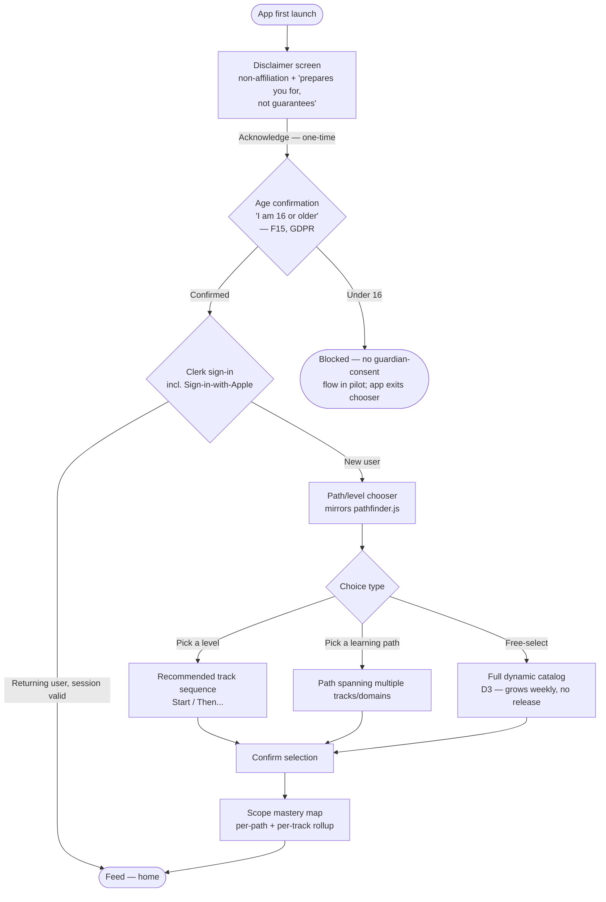

- **Offline:** disclaimer + chooser UI can render from bundled defaults, but the live catalog (H) and Clerk sign-in (C) need connectivity on first run. Once scoped, SC2 onward works offline.
- **Maps to:** U6. Feeds the mastery map scope consumed by SC2/SC5.
- **Note:** the catalog itself is dynamic and academy-fed [D3] — this flow always queries current tracks/paths, never a hardcoded list.
- **Age gate (F15):** the required 16+ confirmation (`06-risks-compliance.md` §5, GDPR) folds directly into the disclaimer-acknowledgement beat (B→B2) rather than a separate screen — one tap alongside the non-affiliation acknowledgement. There is no guardian-consent flow in the pilot, so an under-16 answer exits the chooser rather than proceeding (B3); this is a hard stop, not a soft warning, since the app has no child-specific data-handling path to fall back to.

#### SC1b — Manage scope / add a track (returning-user re-entry, F9)

The diagram above only models first launch. A returning multi-cert user (P3, §3 below) needs a second, always-available entry into the same chooser UI — **additive**, not a repeat of onboarding:

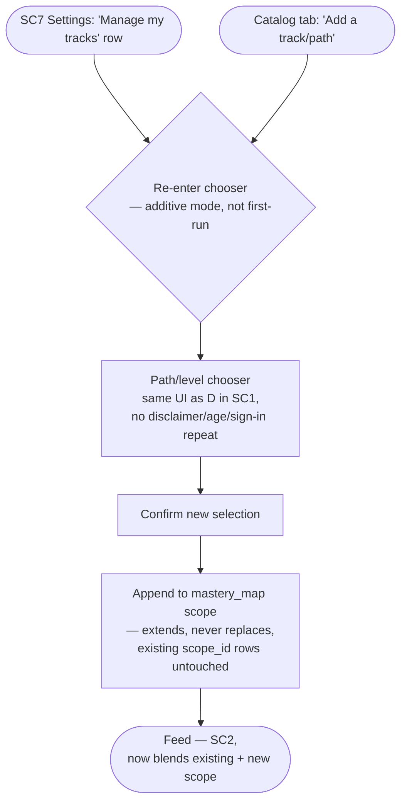

- No disclaimer, age-confirmation, or sign-in step repeats — those are one-time (SC1's B/B2/C), and this is an already-authenticated returning user.
- The effect on `mastery_map` (`02-architecture.md` §3) is strictly additive: new `(scope_type, scope_id, track_id, vendor_id)` rows are inserted for the newly-added track/path; existing rows and their `competence`/`decay_at` are never touched, so adding a track cannot regress or reset progress already earned elsewhere.
- Two entry points, one flow: SC7 Settings gets a **"Manage my tracks"** row (see SC7 below); a Catalog tab (or the Feed's own drill-in, if no separate Catalog tab ships in Stage 1) offers the same **"Add a track/path"** action. Both land on the identical chooser-in-additive-mode.

### SC2 — Feed (home)

The primary surface — the doom-scroll habit loop [01 §1]. Heterogeneous card types, lean-back vs lean-in density, and the ethical soft-stop are the three design ideas that make this screen more than a video feed.

```mermaid
flowchart TD
  A([Open app / tap notification]) --> B[Feed loads<br/>weak-spot-weighted card queue]
  B --> C[/Card rendered/]
  C --> D{Card type}
  D -->|Fact| E[Read + swipe]
  D -->|Question| F[Answer inline]
  D -->|Micro-lesson| G[Short explainer]
  D -->|Scenario| H["Branching scenario (multi-step)"]
  D -->|Audio/video clip| I[Autoplay muted,<br/>tap to unmute]
  D -->|Reward| J[Streak / milestone card]
  F -->|Wrong answer| K["'Explain this' →<br/>Voice Tutor (SC3)"]
  F -->|Correct| L[SM-2 update, queued]
  E --> M[Swipe to next card]
  G --> M
  H --> M
  I --> M
  J --> M
  K --> M
  L --> M
  M --> N{Session time<br/>vs density mode<br/>— default lean-in, F14}
  N -->|Lean-back<br/>opt-in / inferred exception| O[Denser, lower-friction cards<br/>audio/video weighted]
  N -->|Lean-in<br/>default| P[More questions/scenarios,<br/>active recall weighted]
  O --> C
  P --> C
  N -->|Hit daily soft cap ~10 min| Q{Ethical soft-stop<br/>'You've hit today's 10 min —<br/>keep going or bank it?'}
  Q -->|Keep going| C
  Q -->|Bank it| R[Session closed,<br/>streak credited]
  M -->|Tap drill-in| S[Readiness (SC5) /<br/>Library (SC6) /<br/>Settings (SC7)]
```

- **Offline:** fully offline. Cards + SM-2 progress live in `content_cache` / local `progress` [02 §5]; the "explain this" hop to Voice Tutor (K) is the one exit that needs signal.
- **Maps to:** U1 (nudge-driven open), U2 (doom-scroll targeting), U8 (new content appears with no release), U9 (drill-in to cheat-sheets).
- **Design note — lean-back vs lean-in, resolved (F14):** **lean-in (active recall) is the default** for every session; lean-back is the **opt-in or inferred exception**, not a coin-flip between two equally-weighted modes. This matters because getting the inference wrong is not symmetric — serving passive lean-back content to a user in a focused recall session directly violates principle 1 (active-recall-first, `01-vision-usecases.md`), while wrongly staying in lean-in during a genuine gym/commute moment just means slightly denser cards, a much smaller cost. Defaulting to lean-in means a wrong inference degrades toward **more** recall, never less. Context signals (time of day, session length pattern, notification-triggered vs cold-open) can still *infer* lean-back for a likely gym/commute session, but they earn the exception rather than the default. The Settings (SC7) manual override remains, for a user whose context the inference consistently gets wrong.

### SC3 — Voice Tutor

KG-grounded office hours: voice-in, voice-out, cited, with a Socratic quiz-back mode and a graceful offline-degrade state. Two entry points — a deliberate ask (U5) and a reactive one from a missed Feed answer (U4).

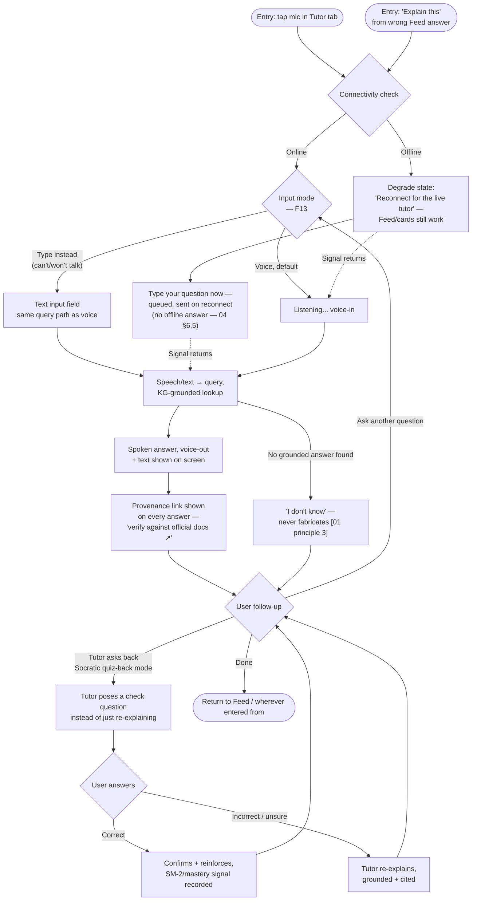

- **Offline:** needs connectivity for the live KG-grounded loop; degrades explicitly (X) rather than failing silently or hallucinating. Feed/cards remain usable while Tutor is down [02 §5].
- **Maps to:** U4 (wrong-answer → explain), U5 (hands-free voice ask).
- **Trust:** every spoken answer surfaces its provenance link (G) — the disclaimer/trust model applies here most directly since voice has no persistent on-screen citation otherwise [01 §8].
- **Text-input fallback (F13):** voice is the default entry (INMODE), but a visible "type instead" option is always available (T) for when the user can't or won't talk — a quiet room, a shared space, a preference not to speak to their phone — feeding the identical query path as voice (same KG-grounded lookup, same provenance link). This is the same "text-first, TTS trails" posture named in `06-risks-compliance.md` §1, made visible in the flow rather than left only as a risk-register mitigation. **Offline-degraded (X) gets its own text path (XT):** rather than a dead "reconnect" screen with nothing else to do, the user can type their question now; it queues and sends the moment signal returns — it is **not** answered locally, since the KG-grounded lookup is online-only (`04-content-factory.md` §6.5) and a locally-approximated answer would violate the never-fabricate principle [01 principle 3]. Queuing (not faking an offline answer) is the honest middle ground for a walking user (U5) who loses signal mid-question.

### SC4 — Podcast

Gym/commute audio surface, built for background use, ending in a recall bridge that converts passive listening back into active recall [01 principle 1].

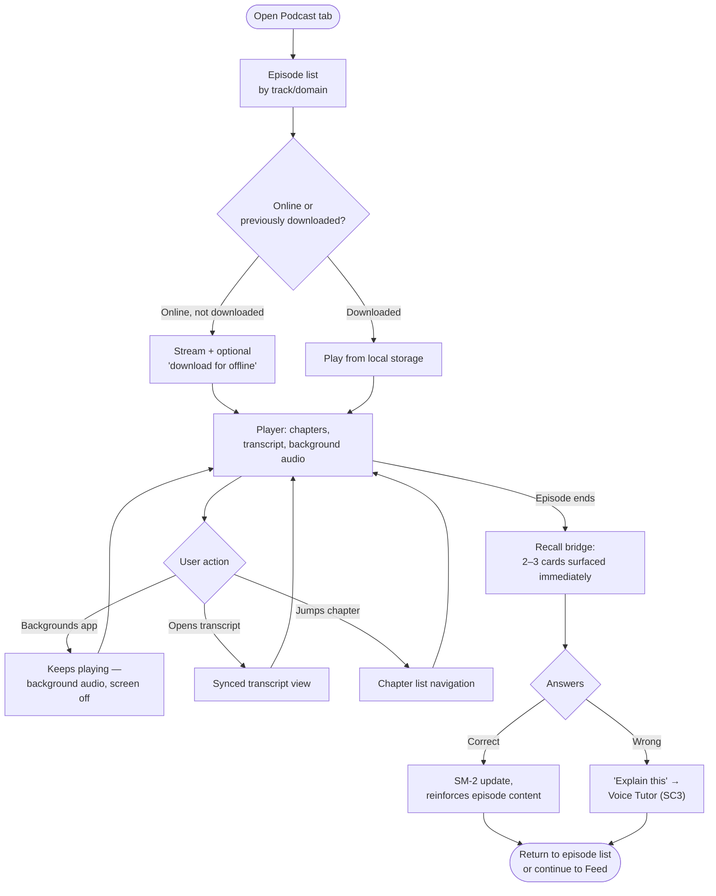

- **Offline:** episode audio, chapters, and transcript are fully usable once downloaded (E/F); the recall bridge cards (K) are Feed-card-shaped and work offline too, since they're served from the same `content_cache` [02 §5]. Only the initial stream/download (D) needs signal.
- **Maps to:** U3 (gym episode → recall cards).
- **v2 scope note:** per [O2] in 00-INDEX, the full Podcast surface leans v2; this flow describes the target shape, with one D-level episode + recall bridge prototyped during the pilot as a side track, not the full catalog.

### SC5 — Readiness

The honest verdict screen — per-domain rings plus a qualifying/non-qualifying call, never inflated [01 principle 3, 01 §8]. Owns presentation only; the underlying formula and thresholds are S03's.

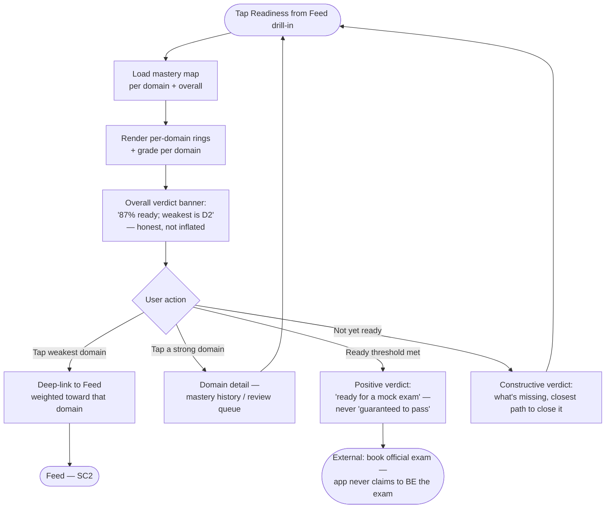

- **Offline:** fully offline — reads the local mastery rollup from `content_cache`/`progress`, no live call needed [02 §5]. Only degrades if the on-device mastery snapshot is itself stale (last-sync indicator, not a blocker).
- **Maps to:** U7. Directly enacts the disclaimer/positioning model — "we get you ready; the official practice exam confirms it" [01 §8].
- **Non-goal reminder:** this screen never replaces or claims to be the vendor's official practice exam [01 §10].

### SC6 — Library / cheat-sheets

The cram-the-night-before screen — a fast, low-friction reference, not a new learning surface.

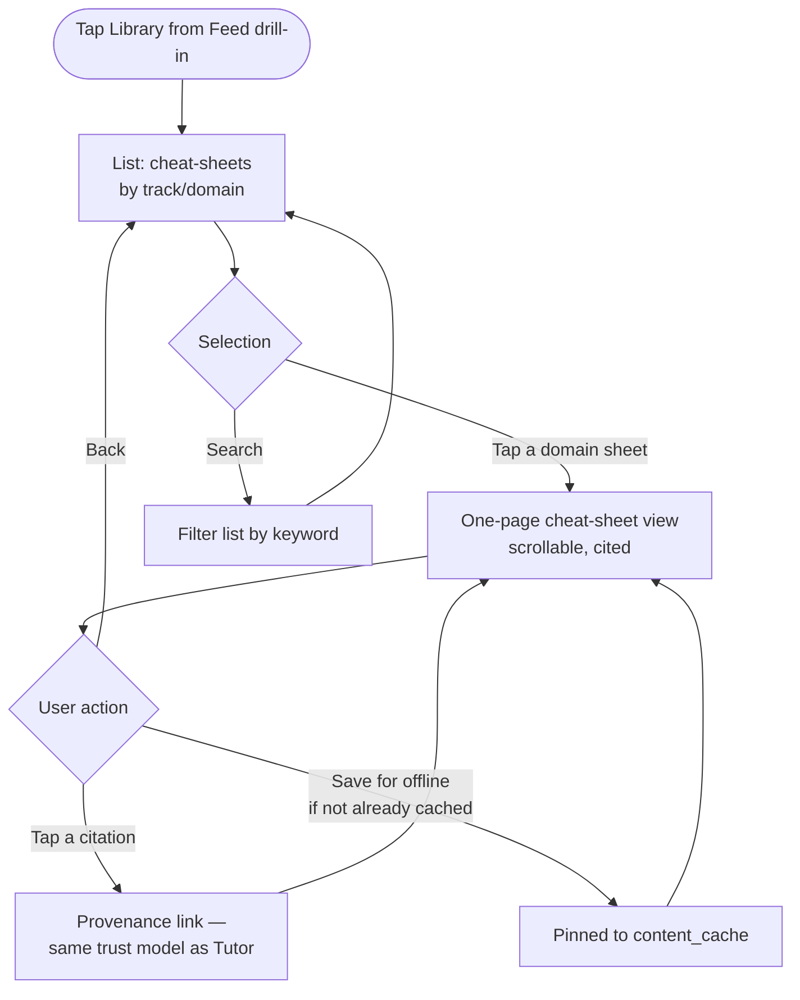

- **Offline:** fully offline once the relevant track/domain content is cached — cheat-sheets are static published content, no different from Feed cards in offline posture [02 §5].
- **Maps to:** U9.

### SC7 — Settings / frequency

Controls the humane-habit principle directly [01 principle 4] — this is where "nudge, don't trap" becomes a literal set of dials.

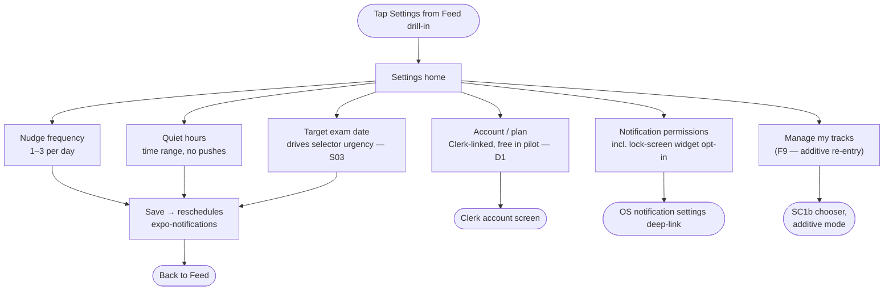

- **Offline:** settings are read/write locally and sync opportunistically; changing frequency/quiet-hours doesn't require connectivity, but the reschedule of server-driven nudges reconciles on reconnect.
- **Maps to:** U1 (frequency/quiet-hours directly shape nudge delivery).
- **Manage my tracks (F9):** a dedicated row that re-enters the SC1 chooser in **additive mode** (SC1b, above) — the entry point a returning multi-cert user (P3) needs to add a newly-published track without disturbing existing progress.

### SC8 — Notifications (answerable push + widget)

Not a full screen — a system-level surface that lets U1 happen without opening the app at all. Two entry shapes: an answerable lock-screen push, and a persistent lock-screen/home widget.

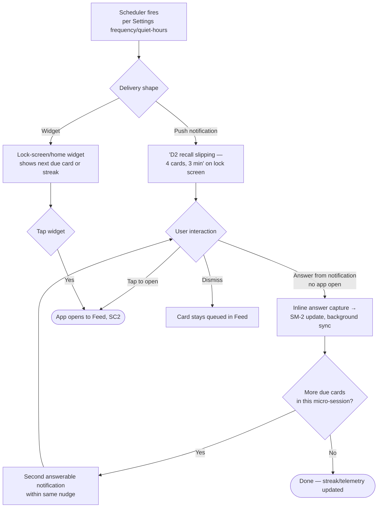

- **Offline:** answerable notifications write locally first (F) — same offline-first posture as the Feed — and sync on reconnect. The scheduler itself is local (`expo-notifications`) once the day's nudges are scheduled [02 §7]; only re-fetching *what to nudge about* needs a prior sync.
- **Maps to:** U1 (specific nudge, answer from lock screen), U8 (the nudge content itself reflects whatever's newly published, with no app update).

---

## 3. Persona journeys

One journey per persona [01 §5], each walking a realistic single session through the screens above.

### P1 — The slammed professional: gym window

*"Tell me what to study, poke me, don't waste my time."* A commute/gym session built entirely around SC4 and SC8 — no deliberate app-opening required.

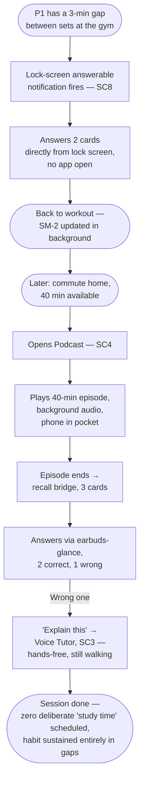

### P2 — The upskiller / career-switcher: path to exam-ready

*"Am I actually on track?"* A structured arc from first install to booking the real exam — the U6→U2→U7 spine.

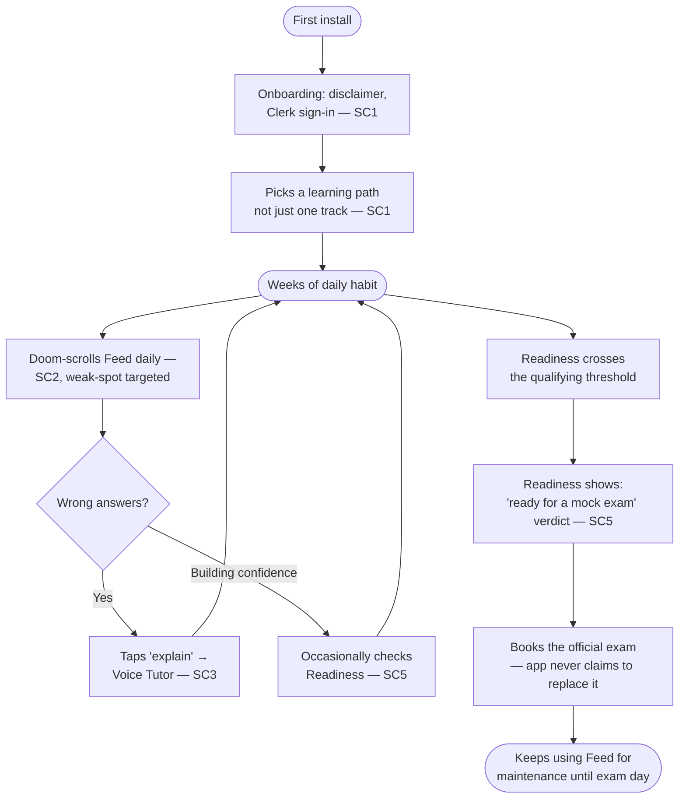

### P3 — The multi-cert learner: maintenance + catalog growth

*"Keep me sharp across everything I've earned."* Already past multiple readiness gates; the interesting behavior is upkeep plus discovering new content with zero app update.

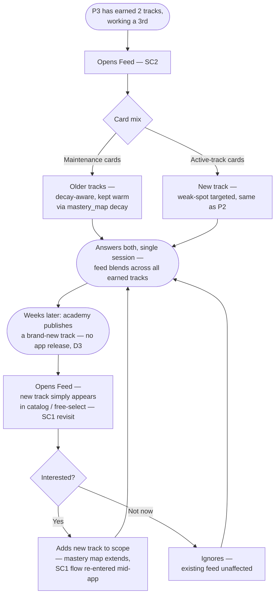

---

## 4. Screen → use case matrix

| Screen | U1 | U2 | U3 | U4 | U5 | U6 | U7 | U8 | U9 |
|---|---|---|---|---|---|---|---|---|---|
| SC1 Onboarding | | | | | | ✅ | | | |
| SC2 Feed | ✅ | ✅ | | (hop) | | | | ✅ | (drill-in) |
| SC3 Voice Tutor | | | | ✅ | ✅ | | | | |
| SC4 Podcast | | | ✅ | (hop) | | | | | |
| SC5 Readiness | | | | | | | ✅ | | |
| SC6 Library | | | | | | | | | ✅ |
| SC7 Settings | ✅ (config) | | | | | | | | |
| SC8 Notifications | ✅ | | | | | | | ✅ | |

Every use case U1–U9 has at least one owning screen; U4/U5 are Tutor-owned even though Feed and Podcast both *hop into* Tutor on a wrong answer — that hop is a shared entry pattern, not a duplicate ownership.

---

## 5. Offline behavior summary

Per [02 §5], offline posture is a spectrum, not a binary — restated here per-screen for design reference:

| Screen | Offline posture |
|---|---|
| SC1 Onboarding | Disclaimer/chooser UI offline-capable; live catalog + Clerk sign-in need signal on first run |
| SC2 Feed | **Fully offline** — cards + SM-2 progress local; only the Tutor hop needs signal |
| SC3 Voice Tutor | **Needs connectivity** — explicit degrade state, never fails silently or fabricates |
| SC4 Podcast | Fully offline once downloaded; initial stream/download needs signal |
| SC5 Readiness | **Fully offline** — reads local mastery rollup |
| SC6 Library | **Fully offline** once cached — same posture as Feed cards |
| SC7 Settings | Read/write local; server-driven reschedule reconciles on reconnect |
| SC8 Notifications | Answerable-push capture is local-first; scheduler is local once scheduled |

Only SC1 (first run) and SC3 (Voice Tutor) have a hard connectivity dependency — everything else is offline-first by design, matching principle 5 [01].

---

## Excludes

- **Hi-fi visuals** — colors, typography, spacing, component states. This week is flows only [D4]; hi-fi is a later phase feeding from these flows into Claude Design [D5].
- **Engine math** — the mastery model, selector weighting, SM-2 formula, and readiness-gate threshold are [`03-mastery-engine.md`](03-mastery-engine.md)'s to define; this doc only shows *where* their outputs surface (e.g., SC5's rings) and *when* their outcomes trigger a screen transition (e.g., readiness crossing a threshold in the P2 journey).

## Open conflicts

None found against D1–D5 or docs 00–02. Two soft ambiguities were flagged here for the S08 red-team rather than resolved unilaterally at the time; both are now resolved by the red-team fix-pass (see Changelog below):

1. **Lean-back/lean-in mechanism — resolved (F14).** Lean-in (active recall) is now the stated default; lean-back is the opt-in/inferred exception, not a coin-flip. See SC2's design note above.
2. **SC1 mid-app re-entry (P3 journey, step H) — resolved (F9).** A dedicated additive-mode re-entry (SC1b) now exists, reachable from SC7 Settings ("Manage my tracks") or a Catalog tab, and its effect on `mastery_map` (append, never replace) is spelled out. See the SC1b subsection above.

## Changelog — red-team fix-pass

Targeted edits applied from [`08-design-red-team.md`](08-design-red-team.md); good content preserved, screen inventory and D1–D5 conformance intact.

- **F15** — SC1 diagram gets an age-confirmation node (B→B2, "I am 16 or older") folded into the one-time disclaimer-acknowledgement beat, with an explicit under-16 hard-stop (B3) since the pilot has no guardian-consent flow. Closes **F15**.
- **F14** — SC2's density-mode branch (N) is relabelled so **lean-in is the default** and lean-back is the opt-in/inferred exception; design note rewritten to state the resolution and why the failure mode is asymmetric (wrong-inference-toward-lean-back is worse than wrong-inference-toward-lean-in). The Settings override is kept. Closes **F14**; resolves the "Lean-back/lean-in mechanism" item in Open conflicts above.
- **F9** — new SC1b subsection: an additive-mode re-entry into the same chooser, reachable from a new "Manage my tracks" row in SC7 Settings or a Catalog tab, that appends to `mastery_map` scope without touching existing `scope_id` rows/progress. SC7's diagram gets the new Settings row (M→N). Closes **F9**; resolves the "SC1 mid-app re-entry" item in Open conflicts above.
- **F13 (UX side)** — SC3 diagram gets a text-input path (T) alongside voice-in as the default entry, plus a queued-text option (XT) from the offline-degrade state (X) that sends on reconnect rather than faking a local answer — consistent with the KG lookup being online-only (`04-content-factory.md` §6.5). Closes **F13** (UX side; see `06-risks-compliance.md` for the security/rate-limit side).
