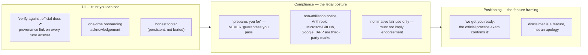

# 06 — Risks & compliance

**Status:** Design draft — Week 1. Part of [00-INDEX](00-INDEX.md).

## 0. Scope of this doc

The risk register for the Mobile Tutor, the disclaimer/trust model rendered into UI + compliance + positioning form, IP/trademark and non-affiliation posture, App-Store review gotchas, privacy/GDPR, and security (allowlist governance, published-only boundary, PII).

**Excludes:** the verification-gate mechanics themselves (cite-supports, adversarial validation, source-drift invalidation) — owned by [`04-content-factory.md`](04-content-factory.md); referenced here only as a named mitigation.

## 1. Risk register

| Risk | Likelihood | Impact | Mitigation | Owner |
|---|---|---|---|---|
| **Notification fatigue** | High | Critical — the make-or-break risk. If nudges aren't specific and easily tunable, users mute in week 1 and the app dies before the habit forms. | Specific, adaptive nudges (name the weak domain + card count + time estimate, per U1 — never generic "come study"); one-tap snooze; a frequency control in Settings; an honest streak (no shame-based re-engagement); a soft daily stop rather than infinite push. | Product + UX (S05 Notifications/Settings flows) |
| **Auto-content quality** | Medium | Critical — a hallucinated question is worse than none; it directly damages the trust model in §2 and the exam-readiness promise. | The S04 verification gate: draft→published split, cite-*supports*-not-cite-*exists* validation, adversarial review, source-drift auto-invalidation. Nothing reaches the app without clearing the gate. *(Mechanics owned by S04 — referenced only.)* | Content/Factory (S04) |
| **Factory reliability** | Medium | High — a silent playbook failure rots content invisibly; this is a **real prior incident class** on this platform (missed/failed automated runs going undetected until a human notices stale output). | Observability and alerting on missed/failed runs — a run that doesn't happen must be as loud as a run that fails loudly. No silent gaps between "last published" and "now." | Platform/Factory (S04 links) |
| **Scope creep** | Medium | Medium — 10 tracks × 3 surfaces × a dynamic, growing catalog is a lot of surface area to keep coherent. | The dynamic catalog (no hardcoding — [D3]) plus the staged roadmap in S07 keeps each release bounded; new content lands as data, not as app work. | Product (S07 roadmap) |
| **Token / production cost** | Medium | Medium — the factory (nightly/weekly/quarterly generation) and any live model calls both carry ongoing spend. | Monitor factory + tutor token spend; the free pilot [D1] bounds exposure to a known, small user count before any pricing decision. | Platform/Finance |
| **Voice latency & cost** | Medium | Medium — a laggy voice tutor breaks the "hands-free on a walk" use case (U5) and erodes trust faster than a slow feed would. | Stream responses; show text first, let TTS trail behind it rather than blocking on full audio synthesis; degrade gracefully to text-only in poor connectivity (per 02 §5 offline/sync). | Engineering (Voice Tutor surface) |

## 2. Disclaimers — three homes

This section renders the trust model defined in [`01-vision-usecases.md`](01-vision-usecases.md) §8 into concrete UI, compliance, and positioning artifacts. It does not redefine the model — it operationalizes it.

- **UI** — every tutor answer (Feed card explanation, Voice Tutor response, Podcast recall bridge) carries a *"verify against official docs ↗"* provenance link, consistent with the mastery-map-wide citation principle in 01 §4 ("grounded & cited"). A one-time onboarding acknowledgement is shown once, before first use, not repeated per session. An honest footer is present and persistent (not a one-time modal that's easy to dismiss and forget) — this is the visible half of the trust model.
- **Compliance** — the legal register never says "guarantees you pass"; the only sanctioned phrasing is **"prepares you for."** A clear **non-affiliation notice** states that Anthropic, Microsoft/GitHub, Google, and IAPP (and any future allowlisted vendor added per-track — see §5) are **third-party marks**, referenced under **nominative fair use** (naming the exam/vendor to describe what the app prepares you for) and not under license. The notice must be explicit that **no endorsement is implied or claimed**.
- **Positioning** — framed as *"we get you ready; the official practice exam confirms it."* This is deliberately a selling point, not defensive copy: it sets the correct expectation (complement, not replacement — 01 §10 non-goals) while keeping the value proposition confident.

## 3. IP / trademark

- Every vendor/certification name used in the catalog (AWS, Microsoft, Google, IAPP, Anthropic, etc.) is a **third-party trademark**, referenced solely to describe what the content prepares a learner for — this is the same **nominative fair use** boundary named in §2.
- No vendor logo, lockup, or brand asset is used without a license; use plain text names only unless a specific license is obtained.
- The non-affiliation notice (§2 Compliance) must appear wherever a vendor/certification name is used prominently (track/course headers, marketing copy, App-Store listing) — not only buried in a terms-of-service page.
- As the catalog grows dynamically [D3], **new vendor marks entering via new tracks are governed by the same rule automatically** — this is a standing policy, not a per-track legal review gate, but the allowlist governance in §6 is the natural checkpoint to confirm a new source's mark usage before a track goes live.

## 4. App-Store review gotchas

| Gotcha | Why it matters | Where it's handled |
|---|---|---|
| **Sign-in-with-Apple is required** if any social login is offered [D1] | Apple mandates SIWA parity whenever another social provider (Google, etc.) is offered on iOS — a missing SIWA option is a common, well-known rejection reason. | Clerk auth setup (02 §4) — SIWA must ship alongside any other social login from day one, not bolted on later. |
| **"Prepares you for," never "guarantees"** | Reviewers (and regulators) scrutinize certification-prep apps for overpromising; "guarantees you pass" reads as a deceptive claim. | Compliance copy register (§2) — the single sanctioned phrasing, enforced everywhere the app talks about outcomes. |
| **No misleading certification claims** | The app must not imply it *is* the certification body, that completing it certifies the user, or that it's officially affiliated/endorsed. | Non-affiliation notice (§2, §3) + positioning framing (complement, not replacement — 01 §10). |
| **Content-generation apps must handle objectionable-content edge cases** | Apple treats apps that generate content (even indirectly, via an AI tutor answering open questions) as needing a moderation/reporting story, even for a narrow exam-prep domain. | Voice Tutor and Feed "explain" (U4/U5) are scoped to grounded, cited answers from the verification gate (S04) — not open-ended generation; still needs a user-facing "report an issue" path and a clear scope boundary (tutor answers exam-domain questions, not general chat) surfaced at onboarding. |

## 5. Privacy / GDPR

- **Identity vs. learning data are separate concerns.** Clerk holds auth identity (02 §3 `users` table, `clerk_user_id`); this is authentication data, not learning data.
- **Telemetry is learning data** (02 §3 `telemetry` table — `answer` / `card_outcome` / `session` / `scenario` events) collected for a stated purpose: personalization (feeding the mastery map) and the factory's improvement loop (identifying weak/confusing items, per 02 §3). This requires a clear purpose statement at onboarding and, where applicable under GDPR, a lawful basis (legitimate interest for core personalization is likely defensible; anything beyond that — e.g., sharing telemetry to improve the factory's *content* rather than just this user's *mastery map* — should be named explicitly rather than assumed bundled).
- **Age gating.** Certification/exam-prep skews adult, but the app must still confirm the audience is 16+ (or the relevant local minimum) at onboarding, since GDPR (and equivalents) treat under-16 data differently and the app currently has no child-specific consent or guardian-consent flow.
- **Data export & delete (right to erasure) — resolved (F8).** A user must be able to export their own data (progress, mastery map, telemetry) and request deletion. Given the shared Clerk identity with the academy [D2], deletion has two distinct blast radii, matching the resolution in `02-architecture.md` §4: **deleting Spine data** (`mastery_map`, `progress`, `telemetry`, `scenario_progress`, `mock_attempts`, `content_cache`) is **independently available per-user**, scoped by `user_id`/`workspace_id`, with no effect on the shared Clerk identity or the web academy — this is the app-local erasure path and satisfies right-to-erasure for the data the app owns. **Deleting the whole account (the shared Clerk identity)** is a **separate, cross-surface action**, gated behind its own explicit confirmation that names the consequence (it also removes access to the web academy) — it is not the default "delete" inside the app. This is now a single, explicit answer, not an open conflict (§7 updated accordingly).
- **Minimise PII in telemetry.** The `telemetry.payload` (jsonb, 02 §3) should carry answer/outcome/session data, not free-text PII; if the Voice Tutor ever logs transcripts for quality review, that is a separate, explicitly-consented data class, not folded silently into the same telemetry stream.

## 6. Security

- **The allowlist is a supply-chain trust boundary.** Per `track.json.verification.sourceOfTruth` (02 §2, S04's ownership), anything on a track's source allowlist can inject content that eventually reaches a learner as a "verified" answer. This makes allowlist maintenance a security-relevant action, not a content-ops afterthought: additions must be **versioned** (so a bad addition can be identified and rolled back) and **governed** (a defined approver, not an open edit path) — mechanics owned by S04, but the security posture belongs here: treat the allowlist with the same rigor as a dependency manifest.
- **The app's published-only read boundary is the safety boundary for the app itself.** Per 02 §6, the app never talks to the raw factory pipeline — it reads only `published` content through the versioned Content API. This means a compromised or malfunctioning factory run cannot reach a user directly; it must first pass through promotion (and the S04 gate). This boundary should be treated as load-bearing: nothing in the app's build should introduce a path that reads draft/unpublished content, even for debugging or preview purposes, without an explicit, separately-reviewed exception.
- **KG/PII handling.** The exam knowledge graphs that ground the Voice Tutor (01 §3, "grounded in exam knowledge graphs") are sourced from allowlisted public/licensed material, not user data — the KG itself should carry no PII. The mastery map and progress tables (02 §3) are the PII-adjacent surfaces (tied to `user_id`); access to them should follow the same tenancy discipline as the rest of the platform (`workspace_id`, per 02 §3).
- **Secrets.** Clerk keys, NotebookLM pipeline credentials (S04), and any model API keys (Voice Tutor, factory generation) are configuration, never hardcoded — consistent with platform-wide secret management practice. This doc does not re-specify a secrets *mechanism* (that's an engineering/deployment concern) but flags that all three integration points (Clerk, NotebookLM, model APIs) carry credentials that must be managed as secrets from day one, including in the free pilot where it might be tempting to hardcode a single shared key.
- **Voice Tutor rate-limit / daily cost ceiling (F13).** The Voice Tutor is an open-ended, per-query LLM endpoint reachable by any authenticated user — with no stated bound, it is both a **spend vector** (an unbounded free-pilot user can drive unbounded model-call cost) and an **abuse vector** (nothing stops scripted or excessive querying). This needs a concrete, per-user limit, not just a monitoring line in §1's risk register: a **daily query cap** (e.g. a fixed number of Voice Tutor turns per user per day) and/or a **daily cost ceiling** per user, enforced server-side at the Spine (not just client-throttled, which a modified client could bypass). When a user hits the cap, the app should degrade honestly — same posture as the offline-degrade state (`05-ux-flows.md` SC3), not a silent failure — and the text-input fallback (`05-ux-flows.md` SC3, F13 UX side) remains available for the rest of the session even if voice-specific quota is separately tracked. The exact numbers are a Stage-2 (Voice Tutor build) tuning decision against real pilot cost data; the requirement to have *a* bound, enforced server-side, is locked here.

## 7. Open conflicts

- **Account-deletion scope — resolved (F8).** §5 now states the single answer, matching `02-architecture.md` §4: Spine data (`mastery_map`/`progress`/`telemetry`/`scenario_progress`/`mock_attempts`/`content_cache`) is independently deletable per-user; full Clerk-identity deletion is a separate, cross-surface action gated behind its own explicit confirmation. No longer an open conflict — see §5 and the Changelog below.
- **No conflict found with D1–D5, 01, or 02.** The risk/compliance model here is additive to the constitution — it does not require re-litigating any locked decision.

## 8. Conformance to locked decisions

| # | Reflected here |
|---|---|
| D1 | §4 — Sign-in-with-Apple required alongside Clerk social login; free pilot bounds cost exposure (§1) |
| D2 | §3/§7 — shared Clerk identity with the academy; account-deletion resolved consistently with `02-architecture.md` §4 (F8) |
| D3 | §1/§3 — dynamic catalog governs scope-creep risk and standing (not per-track) trademark policy |
| D4/D5 | n/a — this doc has no screen/design content |

## Changelog — red-team fix-pass

Targeted edits applied from [`08-design-red-team.md`](08-design-red-team.md); good content preserved, D1–D5 conformance intact.

- **F8 (06 side)** — §5 records the account-deletion resolution to match `02-architecture.md` §4: Spine data independently deletable per-user; full Clerk-identity deletion is a separate, separately-confirmed cross-surface action. §7 Open conflicts and §8 conformance table updated to reflect the resolution rather than an open question. Closes **F8** (06 side; arch side already closed in 02).
- **F13 (security side)** — new §6 bullet specifies a per-user Voice Tutor rate-limit / daily cost ceiling, enforced server-side at the Spine, as a required (not optional) bound on an open-ended LLM endpoint — naming both the spend and abuse angle, and cross-referencing the UX-side text-input fallback and offline-degrade posture. Closes **F13** (security side; see `05-ux-flows.md` for the UX side).
