# 07 — Roadmap

**Status:** Design draft — Week 1. Part of [00-INDEX](00-INDEX.md).

## 0. Scope of this doc

The staged plan from design package to a factory-driven product: what ships in what order, what each stage's entry/exit criteria are, the MVP cut, the sequencing dependency on the academy's content migration, and the decisions still open. This doc does not decide *how* anything is built — engine math is [`03-mastery-engine.md`](03-mastery-engine.md), screens are [`05-ux-flows.md`](05-ux-flows.md), architecture is [`02-architecture.md`](02-architecture.md). It answers *what ships when, and what has to be true before the next stage starts.*

**Excludes:** implementation detail, per-screen specifics (→ 05), engine math (→ 03).

## 1. Staged plan

Four stages. Each exits on **criteria, not a date** — a stage doesn't advance because a calendar page turned, it advances because its exit bar is cleared.

| Stage | Entry criteria | Scope | Exit criteria |
|---|---|---|---|
| **Stage 0 — Design & foundation** | This doc package exists (00–07) | This doc package + doc 08 red-team; academy file→DB **Content API** contract agreed [02 §2, O5] **incl. the new paths/levels objects [D6]**; Clerk setup [D1]; Expo scaffold [O1] | Package red-teamed (08 complete, findings folded back or logged); Content API contract signed off by both the app and academy-migration sides, **including the D6 paths/levels schema** |
| **Stage 1 — MVP (validate the habit)** | Stage 0 exit met | **Feed** as home — dynamic academy-fed catalog, **CCA-F featured** [D3]; SM-2 + 4-bucket adaptive selector [03]; readiness ring [03]; answerable notifications + lock-screen widget [05]; Clerk auth shipping **FREE** [D1]; local-cache→sync [O4]; **age-confirmation (16+) at onboarding [05 SC1, F15]**; **account-deletion — both paths built [02 §4, 06 §5, F8]**. Explicitly **defers** voice tutor, podcast, full factory (see §2 MVP cut) | **Mock-exam score trajectory** (`mock_attempts`) read against the success metrics in [01 §9, F10] — retention read against a defined pilot cohort + window, not raw installs; age-gate [F15] and account-deletion [F8] are **compliance gates**, not optional polish — Stage 1 does not exit with either missing |
| **Stage 2 — v1 (depth)** | Stage 1 exit met | Voice Tutor (KG-grounded, wrong-answer→explain, Socratic quiz-back) [05]; Podcast surface + recall bridge [04/05]; more tracks/paths surfaced from the growing catalog | Voice Tutor and Podcast usage/quality signals read against [01 §9]; no regression in Stage-1 habit metrics |
| **Stage 3 — Factory-on** | Stage 2 exit met | Turn on nightly/weekly generation [04] once the **verification gate** is proven; observability/alerting live *first* [04 §7, 06]; plans switch on **post-pilot** [D1] | Factory running unattended with alerting proven (missed/failed/dormant all distinguishable, [04 §7]); plan/paywall live with no re-architecture needed |

```mermaid
flowchart LR
  subgraph S0["Stage 0 — Design & foundation"]
    direction TB
    A1["Doc package 00–07"]
    A2["Content API contract<br/>agreed with migration [O5]"]
    A3["Clerk setup [D1]"]
    A4["Expo scaffold [O1]"]
  end

  subgraph S1["Stage 1 — MVP<br/>(validate the habit)"]
    direction TB
    B1["Feed home,<br/>dynamic catalog,<br/>CCA-F featured [D3]"]
    B2["SM-2 + 4-bucket<br/>selector [03]"]
    B3["Readiness ring [03]"]
    B4["Answerable notifications<br/>+ lock-screen widget [05]"]
    B5["Clerk auth — FREE [D1]"]
    B6["Local-cache→sync [O4]"]
    B7["Age-gate 16+ [05 SC1, F15]<br/>— compliance gate"]
    B8["Account-deletion,<br/>both paths [02 §4, F8]<br/>— compliance gate"]
  end

  subgraph S2["Stage 2 — v1 (depth)"]
    direction TB
    C1["Voice Tutor<br/>KG-grounded, Socratic [05]"]
    C2["Podcast + recall bridge [04/05]"]
    C3["More tracks/paths<br/>surfaced"]
  end

  subgraph S3["Stage 3 — Factory-on"]
    direction TB
    D1x["Nightly/weekly<br/>generation live [04]"]
    D2x["Observability/alerting<br/>proven first [04 §7, 06]"]
    D3x["Plans switch on<br/>post-pilot [D1]"]
  end

  GATE0{"08 red-team +<br/>Content API sign-off"}
  GATE1{"Mock-trajectory +<br/>retention signal [01 §9, F10]<br/>+ age-gate/deletion built [F15/F8]"}
  GATE2{"Voice/Podcast signal,<br/>no habit regression"}

  S0 --> GATE0 --> S1 --> GATE1 --> S2 --> GATE2 --> S3

  style GATE0 fill:#1a2b3d,stroke:#4a90d9,color:#eee
  style GATE1 fill:#1a2b3d,stroke:#4a90d9,color:#eee
  style GATE2 fill:#1a2b3d,stroke:#4a90d9,color:#eee
```

## 2. MVP cut

What Stage 1 ships versus defers — the line that keeps the MVP a genuine test of the habit, not a rebuild of the whole package at once.

**In (Stage 1 / MVP):**
- Feed as home: dynamic academy-fed catalog (all tracks/paths/levels), CCA-F *featured* but nothing hardcoded [D3]
- SM-2 spaced repetition + the 4-bucket adaptive selector (due / weak-spot / new / stretch) [03]
- Readiness ring + honest per-domain verdict [03, SC5]
- Answerable push notifications + lock-screen widget (U1) [05, SC8]
- Onboarding + path/level chooser mirroring `pathfinder.js`, **including the 16+ age confirmation** [05, SC1, F15]
- Clerk auth, plan-capable schema, **shipping FREE** [D1]
- Local-first cache with Clerk-account sync [O4]
- Library / cheat-sheets (SC6) and Settings/frequency (SC7) — low-cost satellites of the Feed surface already scoped in 05
- **Account-deletion, both paths** — Spine-data deletion and the separate, separately-confirmed full-Clerk-identity deletion [02 §4, 06 §5, F8] — a Stage-1 compliance gate, not a nice-to-have

**Out (deferred to Stage 2 or 3 — explicitly, not silently):**
- Voice Tutor (SC3) — entire surface deferred to Stage 2
- Podcast (SC4) — entire surface deferred to Stage 2, except the single **v2-prototype-during-pilot** side track already called out in [O2] (one D-level episode + recall bridge, built alongside Stage 1 as a side experiment, not part of the MVP's critical path)
- Full content factory automation (nightly/weekly/quarterly generation running unattended) — deferred to Stage 3; Stage 1 content is whatever the academy catalog already has published through the Content API, not a live-generating pipeline
- Plans/paywall/IAP UI — deferred to post-pilot per [D1], regardless of stage

This cut is a direct application of the reframe in [00-INDEX](00-INDEX.md): the MVP proves the **new** 30% (daily nudge, adaptive scheduler, readiness gate) using content and auth that already exist, before spending on the **new-surface** work (voice, audio) or the **new-infrastructure** work (an unattended factory).

## 3. Sequencing dependency — the Content API is the gate for Stage 1

Stage 1 cannot ship against *real, dynamic* content until the academy's file→DB migration exposes the Content API described in [02 §2]. Today's JSON schema (`manifest.json`, `track.json`, per-domain files) is the de-facto contract; the migration's job is to **preserve and expose it**, not fork it [O5]. Concretely:

- The app can be built and scaffolded against the *current* JSON schema as a stable target even before the DB migration lands — the contract is the schema, not the storage mechanism [02 §2, §8].
- But Stage 1's exit criterion (mock-trajectory + retention signal against a live, growing, dynamic catalog [D3, F10]) requires the migration to actually be serving `GET /catalog` / `GET /catalog/{track}` / `GET /catalog/{track}/{domain}` with delta versioning — a static schema mock is enough to build against, not enough to validate the habit loop against real weekly content growth.
- **Academy-side Stage-0 dependency — deliver the paths/levels schema (D6).** Paths and levels are **not in today's files**; per [D6] the file→DB migration must add them as **new content objects** (`GET /catalog/paths`, `GET /catalog/levels` [02 §2]). The app's path/level chooser (SC1) and the `mastery_map` `path` scope [03 §2] have **no source data until the academy ships this schema** — so "deliver paths/levels as first-class content objects" is an academy-side deliverable that gates the Stage-0 Content API sign-off alongside O5. A build agent cannot construct the path branch from `pathfinder.js`'s track-id list.
- **Coordinate, don't fork**: any drift between the app's assumed schema and the migration's actual output re-opens a contract negotiation, not a silent adaptation on either side.

Two build-path notes that ride alongside this dependency:

- **Expo build path** [O1]: the recommended stack (Expo/React Native) lets the academy's pure-function engines (`store.js`, `readiness.js`) port directly to device, and gives OTA content updates via EAS — matching the "new content, no app release" promise [D3, 02 §7]. This is independent of the Content API timing but shapes how Stage 0's scaffold work proceeds.
- **Design tooling handoff** [D5]: this week's flow diagrams (doc 05) become the input to Claude Design (claude.ai/design); `/design-sync` keeps code and design in lockstep component-by-component during build. This handoff happens once Stage 0 exits (package red-teamed) and runs alongside Stage 1 build, not before it.

## 4. Decisions to resolve before/during build

These are gathered from the open items surfaced across the design package. **Owner = Gerard** for all of them — this section lists them for visibility and resolution, it does not resolve them here.

Two items previously open here are now **locked** in [00-INDEX](00-INDEX.md) and applied by the red-team fix-pass:

| # | Decision | Source | Status |
|---|---|---|---|
| D6 | **Paths & levels = first-class NEW content objects** delivered by the academy file→DB migration (resolves red-team F1 / D-01). App mirrors real path/level objects; `mastery_map` `path` scope has real source data; the O5 contract includes them. | [00-INDEX](00-INDEX.md) D6, [02 §2], [03 §2], [08 §4 D-01] | ✅ **Resolved** — applied in 01 §7, 02 §2, 03 §2 |
| D7 | **Readiness gate = every in-scope domain ≥ ~85% weighted competence AND a full mock ≥ vendor pass mark** — NEW logic on top of `readiness.js`, not "reuse" (resolves red-team F2 / D-02). | [00-INDEX](00-INDEX.md) D7, [03 §4], [08 §4 D-02] | ✅ **Resolved** — applied in 03 §1/§4/§5/§6 |

Still open (owner = Gerard):

| # | Decision | Source | When it needs an answer |
|---|---|---|---|
| O1 | Cross-platform stack confirm (Expo/React Native vs. Capacitor prototype) | [00-INDEX](00-INDEX.md) O1, [02 §7] | Before Stage 0 scaffold work starts |
| O2 | Audio timing — full Podcast in pilot or v2 (recommendation: v2, with a single D-level episode + recall bridge prototyped during the pilot) | [00-INDEX](00-INDEX.md) O2, [05 SC4] | Before Stage 2 scoping; the side-prototype decision affects Stage 1 side-capacity |
| O3 | Product name (placeholder "Academy Coach") | [00-INDEX](00-INDEX.md) O3 | Before hi-fi design work (Stage 0→1 handoff to Claude Design) |
| O5 | Content API contract — confirm the migration preserves/exposes today's JSON schema as the versioned API, not a forked shape | [00-INDEX](00-INDEX.md) O5, [02 §2] | Before Stage 0 exit (it's literally Stage 0's exit criterion) |
| — | **Account-deletion scope under shared Clerk identity** — *resolved (F8, [02 §4]):* Spine data (`mastery_map`/`progress`/`telemetry`/`scenario_progress`/`mock_attempts`/`content_cache`) is independently deletable per-user; full Clerk-identity deletion is a separate, separately-confirmed cross-surface action. Remaining work is to build both paths into Stage 1 + mirror the copy in [06 §5]. | [06 §5, §7], [02 §4], [08 F8] | Build into Stage 1 (answer now locked) |
| — | **Feed lean-back/lean-in: inferred vs. user-toggle** — *resolved (F14, [05 §2 SC2]):* lean-in (active recall) is the default; lean-back is the opt-in/inferred exception, so a wrong inference degrades toward more recall, not less. The Settings manual override ships alongside it. Remaining work is to build it, and let pilot signal confirm the inference quality. | [05 §2 SC2 design note], [08 F14] | Build into Stage 1 (answer now locked) |
| — | **Returning user + new-track-publish: re-enter path chooser?** — *resolved (F9, [05 SC1b]):* a dedicated additive-mode re-entry (SC1b), reachable from a "Manage my tracks" row in SC7 Settings or a Catalog tab, appends to `mastery_map` scope without disturbing existing progress. | [05 SC1b, §Open conflicts item 2], [08 F9] | Build into Stage 1 (answer now locked) |
| — | **Age-gate placement (F15)** — *resolved:* a 16+ age-confirmation beat folds into SC1's one-time disclaimer-acknowledgement screen, with a hard stop (no guardian-consent flow) for under-16. | [05 SC1, F15], [06 §5] | Build into Stage 1 — a compliance gate, see §1 exit criteria |
| — | **Voice Tutor rate-limit / cost ceiling + text fallback + KG retrieval contract (F13, gap #13)** — *resolved:* a text-input fallback ships in SC3 (voice-in default, always-available "type instead"), a queued-text path covers offline-degrade, a per-user daily rate-limit/cost ceiling is specified server-side, and the KG's retrieval contract (what it holds, how the tutor queries it, online-only) is documented. | [05 SC3, F13], [06 §6], [04 §6.5] | Build into Stage 2 (Voice Tutor) — answer now locked, implementation is Stage-2 scope per §2's MVP cut |

## 5. Review gates

Each stage transition is a gate, not a checkpoint on a calendar:

- **Gate 0 → 1:** Doc 08 (red-team) complete, findings addressed or explicitly logged as accepted risk; Content API contract [O5] signed off by both sides. No code ships against a moving-target schema.
- **Gate 1 → 2:** Stage 1's **mock-exam score trajectory + retention signal**, read against a defined pilot cohort/window, against [01 §9] success metrics (habit: D1/D7/D30 retention, sessions/week, nudge tap-through; learning: mock-trajectory as the headline signal, weak-domain closure and readiness-gate reach as secondary — [F10]); **and** the age-gate [F15] and account-deletion [F8] compliance gates are built (§1). A weak learning/habit signal here is a decision point for Gerard (iterate on Stage 1, or proceed anyway with eyes open) — not an automatic advance. The two compliance gates are not a judgment call: Stage 1 does not exit without them.
- **Gate 2 → 3:** Voice Tutor and Podcast usage/quality signals healthy, and — critically — **no regression in the Stage-1 habit metrics** (adding surfaces must not cannibalize the core Feed loop that proved the habit).
- **Gate 3 (factory-on) is itself two sub-gates, sequenced:** observability/alerting proven **before** unattended generation turns on [04 §7 — a playbook that stops running without anyone noticing is the named risk]; then, separately, plans switch on post-pilot [D1] once the factory is trusted to run unattended.

## Open conflicts

None found against D1–D5 or docs 00–06. This doc surfaces (§4) rather than resolves the open decisions already flagged upstream in 00-INDEX, 05, and 06 — consistent with those docs' own instruction not to unilaterally settle them. No new conflicts were introduced synthesizing the staged plan; the MVP cut in §2 is a direct, non-descoping application of the locked decisions (D1 free pilot, D3 dynamic catalog, O2's stated recommendation) rather than an independent scope call.

## Changelog — red-team fix-pass

Targeted edits applied from [`08-design-red-team.md`](08-design-red-team.md); good content preserved, staged-plan structure and D1–D7 conformance intact.

- **F10** — Stage 1's exit criteria (§1 table, mermaid diagram, §3, §5 Gate 1→2) renamed from "retention + readiness-lift signal" to **mock-exam score trajectory** as the headline learning metric, with retention read against a defined pilot cohort + window. Closes **F10** (roadmap side; metric itself defined in `01-vision-usecases.md` §9).
- **F15 / F8** — Stage 1's entry/exit criteria (§1 table, mermaid diagram, §5 Gate 1→2) now name **age-gate (16+)** and **account-deletion (both paths)** as explicit Stage-1 **compliance gates** — not optional polish, not a judgment call at the gate. §2 MVP cut's "In" list adds account-deletion explicitly. Closes **F15** and **F8** (roadmap side; both already resolved in `05-ux-flows.md`/`06-risks-compliance.md`/`02-architecture.md`).
- **F14 / F9 / F13 / gap #13** — §4's "still open" table rows for lean-back/lean-in, returning-user re-entry, and Voice Tutor rate-limit/fallback/KG-contract updated to show each is now **resolved** (design decision locked upstream in 05/06/04), with only the build work remaining — mirroring how D6/D7 were already tracked as "locked, applied." No longer presented as open design questions.
