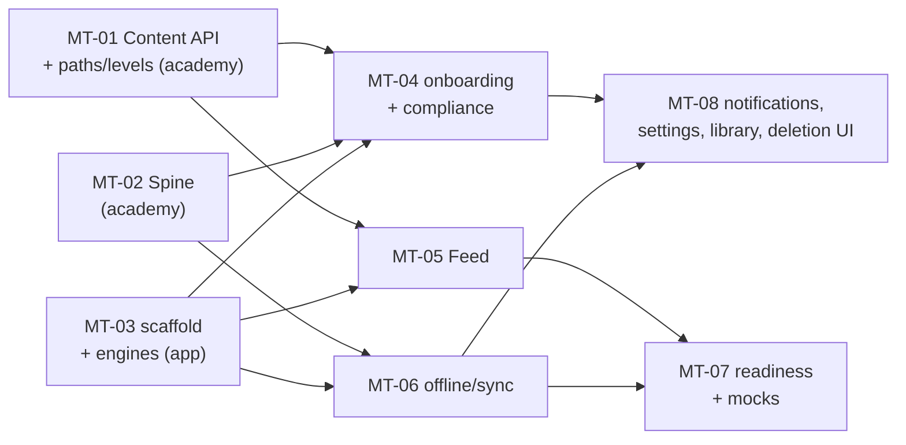

# PRD-MT-00 — Mobile Tutor build program (index)

**Status:** drafted for review · **Owner:** Gerard Kavanagh · **Created:** 2026-07-09
**Parent:** [../00-INDEX.md](../00-INDEX.md) (design package, verdict **GO**, 17/17 findings swept)
**Scope:** turns the reviewed design package (docs 00–08) into wave-ordered build PRDs. Design is settled; these PRDs decide *how the build is cut*, not *what the product is*.

---

## 1. The program in one view

Three codebases, one contract:

| Workstream | Lives in | PRDs |
|---|---|---|
| **Content API** — versioned, published-only catalog incl. NEW paths/levels (D6) | `automatos-academy` (extends `server.js`) | MT-01 |
| **Spine** — Postgres user-state + Clerk + sync + GDPR deletion | `automatos-academy` (same service) | MT-02 |
| **App** — Expo/RN client: engines, Feed, onboarding, offline, readiness, notifications | new repo (see D-R2) | MT-03…MT-08 (+09/10 Stage 2) |

**Wave order** (each wave's PRDs are parallel-safe; a wave starts when its dependencies are merged):

| Wave | Stage | PRDs | Gate to next |
|---|---|---|---|
| **W0** | Stage 0 foundation | MT-01 Content API · MT-02 Spine · MT-03 scaffold + engines | Contract signed (O5+D6) · CI green on all three · Clerk tenant live |
| **W1** | Stage 1 core | MT-04 onboarding/compliance · MT-05 Feed · MT-06 offline/sync | Feed loop works end-to-end against live catalog |
| **W2** | Stage 1 complete | MT-07 readiness/mocks · MT-08 notifications/settings/library | **Stage-1 compliance gates: F15 age-gate + F8 deletion — no exit without both** |
| **W3** | Stage 2 (scope later) | MT-09 Voice Tutor · MT-10 Podcast (stubs now, full PRDs at Stage-2 scoping per O2) | per [../07-roadmap.md](../07-roadmap.md) §5 |

## 2. Decision register (Gerard-owned; recommendations pre-loaded)

Build starts on **D-R1..D-R3**; nothing in W0 needs D-R4/D-R5 answered.

| # | Decision | Recommendation | Blocks |
|---|---|---|---|
| **D-R1 (O1)** | Stack confirm | **Expo/React Native.** `automatos-mobile` already proves the exact stack in-house (Expo 53, expo-router, Clerk, React Query); the pure engines port verbatim. Capacitor only as a throwaway prototype — skip it. | MT-03 start |
| **D-R2** | App repo | **New repo `AutomatosAI/automatos-academy-app`**, seeded from `automatos-mobile`'s config patterns (not a fork — zero domain overlap, different brand per D2). | MT-03 push/PR |
| **D-R3** | Spine hosting | **Extend the academy Railway service** (`server.js` already reserves `/api/*`) + Railway Postgres addon. One deploy, one repo, content already there; split later only if load demands it. | MT-02 deploy |
| **D-R4** | Content storage phasing | **File-backed Content API v1 now** (contract = schema, storage = deployed JSON; publish = deploy), **DB-backed v2 behind the same contract** when factory-prep starts (Stage 2/3 boundary). Roadmap §3's Stage-1 exit needs the *API served with versioning* — v1 satisfies it while content keeps growing via the current git flow. **This phases the "file→DB migration", it does not descope it.** | Stage-3 factory only |
| **D-R5 (O3)** | Product name ("Academy Coach" placeholder) | Decide before hi-fi/App-Store listing; engine + API work unaffected. | MT-04 store copy, Claude Design handoff |
| **D-R6** | Clerk tenant | New Clerk application for the Academy (web academy has **no auth today** — "shared identity" means the app creates the tenant and the web academy adopts it later). Needs SIWA + Google configured. Gerard provisions keys. | MT-02/MT-03 integration tests vs live Clerk |

## 3. Binding constraints carried from the design package

Every build PRD inherits these; they are restated once here, not re-argued per PRD:

- **Published-only read** — no build path reads draft content ([../02-architecture.md](../02-architecture.md) §8, 06 §6).
- **F4 PK rule** — every user-state row carries `vendor_id` + `track_id`; ids are unique only within a track.
- **F11** — no plan/pace model exists. Selector throttles on urgency + competence only. Do not build one.
- **F12 OTA line** — content instances via OTA/data; new content types/renderers = App-Store release.
- **Compliance copy** — "prepares you for", never "guarantees"; non-affiliation notice wherever a vendor mark is prominent; plain-text vendor names only, no logos (06 §3/§4).
- **F15 + F8** — 16+ age gate (hard stop) and account deletion (both blast radii) are Stage-1 **exit gates**.
- **Provenance is UI** — every served item shows "verify against official docs ↗" and its grounding label (04 §6).
- **Spine is source of truth for rollups** — clients never merge `mastery_map`; conflict rule = later answer timestamp wins (02 §5).
- **Mock trajectory is the headline metric** (F10) — instrument from day one (01 §9).

## 4. Verification standard (all PRDs)

- **CI is the only gate** — no local runs. Academy repo gains a test workflow in MT-01 (it has none today); the app repo ships with one from its first commit (typecheck, lint, unit tests; engines ≥80% coverage — they're pure functions, no excuse).
- Every PRD's stories carry verifiable acceptance criteria; UI stories get screenshot verification during build (dev-build previews), not hand-waving.
- PRs per story-group; nothing merges red; Gerard merges.

## 5. PRD roster

| PRD | Title | Repo | Wave |
|---|---|---|---|
| [PRD-MT-01](PRD-MT-01-content-api.md) | Content API v1 + paths/levels (D6) | academy | W0 |
| [PRD-MT-02](PRD-MT-02-spine.md) | Spine: Postgres, Clerk, sync, deletion | academy | W0 |
| [PRD-MT-03](PRD-MT-03-app-scaffold-engines.md) | App scaffold + engine port (SM-2, selector, decay, readiness) | app | W0 |
| [PRD-MT-04](PRD-MT-04-onboarding-compliance.md) | Onboarding SC1/SC1b: disclaimer, age gate, sign-in, chooser, prefetch | app | W1 |
| [PRD-MT-05](PRD-MT-05-feed.md) | Feed SC2: cards, session loop, soft-stop, provenance | app | W1 |
| [PRD-MT-06](PRD-MT-06-offline-sync.md) | Offline cache + delta sync + conflict resolution | app | W1 |
| [PRD-MT-07](PRD-MT-07-readiness-mocks.md) | Readiness SC5 + full mocks + F10 instrumentation | app | W2 |
| [PRD-MT-08](PRD-MT-08-notifications-settings-library.md) | Notifications/widget SC8 + Settings SC7 + Library SC6 + deletion UI | app | W2 |
| [PRD-MT-09](PRD-MT-09-voice-tutor-STUB.md) | Voice Tutor SC3 (Stage-2 stub) | app+academy | W3 |
| [PRD-MT-10](PRD-MT-10-podcast-STUB.md) | Podcast SC4 + recall bridge (Stage-2 stub) | app | W3 |
| [CONTENT-API-CONTRACT](CONTENT-API-CONTRACT.md) | The O5/D6 sign-off artifact — endpoint + shape spec | contract | W0 exit |

## 6. Out of scope for this program

- Factory automation (Stage 3) — Automatos-pod playbook work, PRD'd when Stage 2 exits.
- Plans/paywall/IAP UI — post-pilot (D1); schema stays plan-capable, UI does not exist.
- Web academy adoption of Clerk / reading the Content API — enabled by this program, scheduled separately.
- Hi-fi visual design — D5 flow: doc 05 diagrams → Claude Design → `/design-sync` during build.

## 7. Fix-pass note

The cosmetic remainders [../08-design-red-team.md](../08-design-red-team.md) §7 lists (telemetry `event_type` drift in 06; SC2 node H label + 03's `scenario_progress` back-link) are **already fixed in the package as committed here** — verified against 06 §5, 05 SC2 node H and 03 §3; only 08's own §7 self-description is stale. Nothing remains open from the red-team sweep.
